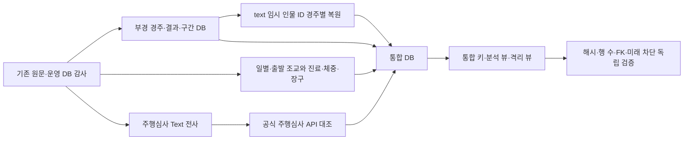

# 부산경남 자료 수집·정제·통합 적재 과정 (2026-09-16)

## 1. 문서 목적

이 문서는 부산경남경마장 역사 자료를 기존 운영 DB와 분리된 하나의 연구용
SQLite로 구축한 과정을 정리한다. 다른 작업자가 앞선 대화를 보지 않고도 어떤
원천을 사용했는지, 어떤 키와 공식 ID로 연결했는지, 무엇을 분석에서 제외해야
하는지, 향후 서울·제주·영천 등 다른 DB와 어떻게 합쳐야 하는지를 확인할 수
있게 하는 것이 목적이다.

최종 산출물은
[`busan_complete.sqlite3`](../data/research/busan_complete_db_20260916/busan_complete.sqlite3)이다.
기존 운영 DB, 기존 세 연구 DB, 원문, 모델, registry, 예측·배팅 경로는 수정하지
않았다.

| 항목 | 최종 상태 |
| --- | ---: |
| 대상 경마장 | 부산경남 `venue_code=BUSAN`, 공식 경주 `meet=3` |
| 경주 | 15,577경주·171,064출전 |
| 주행심사 | 3,400심사·29,762출전 |
| 통합 이벤트·출전 | 18,977이벤트·200,826출전 |
| 연구 경주 출전 | 167,960행 |
| 경주 구간 원천 필드 | 2,565,960행 |
| 일별 조교·출발조교 | 2,946,478·222,158행 |
| 진료 Text·진료 API | 628,141·108,901행 |
| 장구·별도 체중 Text | 170,328·169,251행 |
| 공식 ID 확정 주행심사 | 29,757/29,762행 |
| 원천 artifact 원장 | 11,890건 |
| 비밀키 제거 요청 원장 | 63건 |
| 최종 DB 크기 | 2,446,991,360바이트 |
| 최종 DB SHA-256 | `5e679fce63e8d8dbbe0331653eebf8be39d7b43613d62dacc1fdc8e2b95af22d` |

여기서 적재 완료는 확보한 공식 원천과 보관 Text에서 검증된 범위를 모두
정규화해 보존했다는 뜻이다. 과거 원천의 당시 공개시각, 모든 과거 기록의 절대적
완전성, 모델 성능 또는 실시간 배팅 시점 이용 가능성을 보증하는 뜻은 아니다.

## 2. 입력 스냅샷과 전체 흐름

통합 DB는 검증을 마친 다음 세 격리 DB를 입력으로 사용했다.

| 입력 DB | 내용 |
| --- | --- |
| [`history.sqlite3`](../data/research/busan_history_20260915/history.sqlite3) | 경주·출전·결과·구간·조교·진료·체중·장구·주로·경주 전 연구 이력 |
| [`trials.sqlite3`](../data/research/busan_trial_linkage_20260915/trials.sqlite3) | 전체 주행심사, 공식 주행심사 API, 말 ID 후보와 경주 전 심사 이력 |
| [`linkage.sqlite3`](../data/research/busan_temp_id_linkage_20260915/linkage.sqlite3) | 2015~2024년 `text:` 조교사·마주 ID의 경주 당시 공식 관계 근거 |



통합 생성기는 `history.sqlite3`를 SQLite backup API로 임시 파일에 복제하고,
주행심사와 임시 ID 테이블을 물리적으로 복사한 뒤 통합 키 테이블과 뷰를 만든다.
검증이 끝난 임시 파일만 최종 파일명으로 원자적 교체한다.

## 3. 범위와 라벨

경주는 `race.label_scope`로 구분한다.

| 값 | 범위 | 용도 |
| --- | --- | --- |
| `target` | 2006년 이후 공식 정식 경주 | 학습 라벨 후보 |
| `warmup` | 2005-09-30 이후 2005년 공식 정식 경주 | 2006년 초기 과거 이력 |
| `mock` | 2005년 이전/초기 모의경주 328개 | 정식 경주 라벨에서 제외 |
| `trial_only` | 주행심사·주행검사·능력검사 | 정식 경주와 별도 사건 |

2006년 기준값은 정식 경주 578개·출전 6,569행이다. `dacom01`, `dacom12`,
`dacom71`의 2006년 경주 표제 키도 각각 578개이며 집합 차이가 없다. 2006년
출전행의 `hrNo/jkNo/trNo/owNo`는 모두 양성이다.

## 4. 경주·출전·결과·구간

공식 경주결과 API를 기준 원천으로 `race`, `entry`, `result`, `section`을
구성했다.

- 경주 키: `(meet, race_date, race_no)`
- 출전·결과 키: 경주 키 + 공식 `hr_no`
- 교차 확인: `chul_no`, 마명
- 사람 관계: 해당 경주 공식 결과의 `jkNo/trNo/owNo`
- ID 형식: 선행 0과 원문 타입을 보존하는 `TEXT`

`result.result_status`는 정상 완주, 실격, 주행중지, 출발제외, 경주제외,
출전취소, 무효/미확정 등을 구분한다. 동착은 같은 정상 `finish_order`를 가진
복수 행으로 보존한다. 현재 경주의 결과와 구간은 예측 입력이 아니라 목적변수
영역이다.

`section`은 API 원천 필드명을 유지한다. `buS1fTime`, `buS1fAccTime`,
`buG3fAccTime`, `bu_3fGTime`처럼 의미가 다른 열을 하나로 합치지 않았다.
현재 통합 DB는 원천별 초 값을 보존하며 제주 DB처럼 약 200m 파생 구간으로
일괄 변환하지 않는다.

## 5. 경주 당시 공식 인물 ID와 임시 ID

2015~2024년 운영 DB의 부경 출전 35,157행에는 이름으로 만든 `text:` 조교사·
마주 ID가 있었다. 공식 결과 원문을 `(meet, 경주일, 경주번호, hrNo)`와
출전번호·마명으로 대조해 각 경주의 공식 `trNo/owNo` 관계를 복원했다.

`legacy_entry_actor_linkage` 41,346행은 조교사 관계 20,774행과 마주 관계
20,572행이다. 각 경주에서의 공식 관계는 보존됐지만 임시 ID 자체를 전역 인물
하나로 치환할 수 없는 101개는 `quarantined_legacy_identity`에 남겼다. 다른
DB와 통합할 때도 `legacy_temporary_id_link.temporary_id`를 공식 인물 ID로
사용하면 안 된다.

## 6. 주행심사

보관 `dacom23` Text 1,053파일을 전사하고 공식 주행심사 API 2004~2026년
29,762행과 대조했다.

| 항목 | 수치 |
| --- | ---: |
| Text 출전행 | 29,736 |
| 공식 API 출전행 | 29,762 |
| Text/API 정확 키 대응 | 29,736 |
| Text에 없던 2019-11-30 API 보강 | 3심사·26행 |
| 공식 말 ID 확정 | 29,757 |
| 미확정 | 5 |

기본키는 `(meet, trial_date, trial_no, chul_no)`다. API가 공식 `hrNo`를
제공하면 정확 키를 직접 근거로 사용했다. API에도 `hrNo`와 마명이 없는
해피머니 3행, 지니블레이드 1행, 스티캣 1행은 이름 하나로 확정하지 않았다.

기존 `history.sqlite3.trial_result_text` 5,413행은 초기 파서의 부분 결과다.
통합 DB에서 삭제하지 않고 원천 대조용으로 보존하지만, 전체 주행심사 분석에는
`trial_entry` 또는 `analysis_trial_entry`를 사용해야 한다.

## 7. 영남 권역과 영천 분리

공식 경주결과 API는 부산경남을 `meet=3`, 영천을 `meet=4`로 구분한다. 반면
주행심사 API 명세는 `meet=3`을 영남 권역으로 정의하며 영천 시행 이후 부산경남과
영천을 합쳐 `meet="영남"`으로 표출할 수 있다.

이를 위해 통합 DB는 다음 값을 분리한다.

| 열 | 의미 |
| --- | --- |
| `venue_code` | 실제 경마장 표준값. 현재 자료는 `BUSAN` |
| `canonical_meet` | 통합용 실제 경마장 번호. 부산 3, 향후 영천 4 |
| `region_code` | 권역. 부산과 영천은 `YEONGNAM` |
| `source_meet_raw` | 원 API 요청값. 현재 3 |
| `source_meet_label` | 응답 원문. 경주 `부산경남`, 심사 `영남` |
| `venue_resolution_method` | 실제 부산으로 판정한 근거 |

현재 심사 29,736행은 부산 Text와 정확 키가 일치하며 추가 26행은 2019년 공식
API 카드이므로 전부 `BUSAN/confirmed`로 적재했다. 향후 수집되는 주행심사
`meet=3/영남` 행은 부산 또는 영천 시행 근거를 별도로 확인하기 전까지
`venue_unresolved`로 격리해야 한다.

## 8. 조교·진료·체중·장구와 사건 자료

| 자료 | 기간 또는 행 수 | 연결 정책 |
| --- | --- | --- |
| 일별 조교 | 2004-06-30 이후 2,946,478행 | 공식 `hrNo` 직접 연결 |
| 출발조교 | 2009-05-21 이후 222,158행 | 공식 `hrNo` 직접 연결 |
| 진료 API | 2019-04-07 이후 108,901행 | 공식 `hrNo` 직접 연결 |
| 진료 Text | 628,141행 | 확정 205,148, 나머지 격리 |
| 장구 | 170,328행 | 공식 출전키로 전부 연결 |
| 별도 체중 Text | 169,251행 | 확정 167,977, 미연결 1,274 격리 |
| 말취소·기수변경 공지 | 6,159행 | 확정 6,120, 나머지 격리 |

출발조교의 2006~2008년은 원천 시작 전이므로 0회가 아니라
`source_unavailable`이다. 진료 Text의 모호·미연결 행도 건강 사건 0으로
바꾸지 않는다.

## 9. 최종 DB의 주요 테이블과 뷰

| 영역 | 기본 테이블 | 일반 분석 뷰 |
| --- | --- | --- |
| 경주 | `race`, `entry`, `result`, `section` | `analysis_race_entry_history` |
| 주행심사 | `trial`, `trial_entry`, `trial_api_entry`, `trial_candidate` | `analysis_trial_entry` |
| 통합 사건 | `unified_event`, `unified_event_entry`, `unified_event_result` | `analysis_unified_event_entry` |
| 조교 | `training_event` | `analysis_race_entry_history`의 과거 집계 |
| 진료 | `medical_event`, `medical_api_event` | 확정 행 및 과거 집계 |
| 체중·장구 | `race_day_weight`, `entry_equipment` | 경주 출전키로 사용 |
| 임시 인물 ID | `legacy_entry_actor_linkage`, `legacy_temporary_id_link`, `legacy_candidate_evidence` | 경주 당시 관계만 사용 |
| 원천·요청 | `source_artifact`, `source_request`, `coverage_record` | 해당 없음 |
| 상태·메타데이터 | `dataset_metadata`, `issue_summary`, `venue_dimension` | 해당 없음 |
| 격리 | 원본 테이블 상태열 | `quarantined_*` 뷰 |

전체 열·형식·PK·뷰 SQL과 행 수는
[`catalog.json`](../data/research/busan_complete_db_20260916/catalog.json)에 있다.

`analysis_race_entry_history`는 167,960개 연구 출전행에 경주 전 경주·조교·
출발조교·진료·주행심사 이력을 붙인다. 주행심사는
`last_confirmed_trial_date < race_date`를 강제한다. 현재 결과·현재 구간은 이
과거 집계에 포함되지 않는다.

## 10. 다른 DB와 통합할 때의 키

다른 경마장 또는 별도 연구 DB와 합칠 때 `meet`만으로 병합하지 않는다.
다음 네임스페이스 키를 사용한다.

```text
event key = (venue_code, event_kind, event_date, event_no)
entry key = (event_id, participant_no)
horse history key = (hr_no, event_date)
source key = (source_namespace, source_table, source primary key)
```

현재 `event_id` 형식은 다음과 같다.

```text
RACE:BUSAN:20260911:01
TRIAL:BUSAN:20260910:01
```

향후 예시는 `RACE:JEJU:...`, `RACE:SEOUL:...`, `RACE:YEONGCHEON:...`처럼
구성한다. `hrNo`, `jkNo`, `trNo`, `owNo`는 숫자로 변환하지 않고 문자열로
유지한다. 사람의 현재 프로필을 과거 사건에 소급하지 않으며, 각 이벤트의 공식
관계 행을 사용한다.

통합 시 권장 순서는 다음과 같다.

1. 상대 DB의 실제 경마장을 `venue_code`로 먼저 확정한다.
2. `event_kind`를 정식 경주·주행심사·기타 사건으로 분리한다.
3. `event_id` 충돌과 날짜·번호 중복을 검사한다.
4. 참가자는 `participant_no`와 공식 `hrNo`를 함께 대조한다.
5. 출처가 다른 같은 사실은 삭제하지 않고 `source_namespace`로 보존한다.
6. 분석 뷰에서만 원천 우선순위와 중복 제거 규칙을 적용한다.
7. 미확정·충돌행은 통합 기본 테이블에 강제 ID를 넣지 않는다.

## 11. 원천 추적과 검증

`source_artifact`에는 선행 manifest를 합친 11,890개 경로·역할·SHA-256·크기가
있다. `source_request`에는 공식 결과·진료·주행심사 및 API 명세 요청 63건의
요청 범위, 페이지, 응답 건수, 수집시각, 응답 해시를 저장했다. 인증키가 포함된
URL은 저장하지 않았다.

운영 DB `data/horse_racing.sqlite3`는 선행 연결 작업 이후 계속 운영되어 크기가
변했다. 통합 DB는 운영 DB를 다시 읽어 재판정하지 않고 고정된 세 연구 DB를
입력 스냅샷으로 사용한다. 선행 시점 운영 DB 해시는 원장에 보존하고 현재 차이는
`mutable_operating_reference_drifts`로 보고한다.

독립 검증은 다음을 확인한다.

1. 세 입력 DB의 모든 기본 테이블 행 수 보존
2. 통합 이벤트·출전·결과 기본키 유일성
3. SQLite `integrity_check=ok`
4. 외래키 위반 0건
5. 2006년 578경주·6,569출전과 네 공식 ID 완전성
6. 주행심사 API `meet` 원문과 부산 판정 근거 분리
7. 167,960개 연구 행과 미래 주행심사 연결 0건
8. 미확정 행의 격리 뷰 행 수
9. 요청 원장 서비스 키 제거
10. 원천 artifact 크기 및 선택적으로 전체 SHA-256 재검사

결과는
[`independent_validation.json`](../data/research/busan_complete_db_20260916/independent_validation.json)과
[`completion_audit.json`](../data/research/busan_complete_db_20260916/completion_audit.json)에
있다.

## 12. 재현 명령

프로젝트 루트에서 실행한다.

```bash
cd /Users/kimyongjin/Desktop/horse_racing

PYTHONPATH=src .venv/bin/python scripts/build_busan_complete_db.py --force
PYTHONPATH=src .venv/bin/python scripts/verify_busan_complete_db.py --full-hash
```

`--force`가 없는데 최종 DB가 이미 존재하면 생성기는 중단한다. 생성 중에는 임시
DB만 사용하며 검증 전 파일을 최종 이름으로 부분 교체하지 않는다.

## 13. 현재 남은 범위

| 구분 | 남은 수 | 처리 |
| --- | ---: | --- |
| 주행심사 말 ID | 5 | `quarantined_trial_entry` |
| 진료 Text 비확정 | 422,993 | `quarantined_medical_text` |
| 체중 Text 비확정 | 1,274 | `quarantined_race_day_weight` |
| 취소·기수변경 공지 비확정 | 39 | `quarantined_race_notice` |
| 임시 인물 전역 동일성 | 101 | `quarantined_legacy_identity` |
| 공식 결과의 조교사·마주 ID 공란 | 각각 21 | `issue_summary`, 원문 공란 유지 |

모든 연구 이력은 당시 공개시각이 별도로 입증되지 않아 기본적으로
`retrospective_only`다. 이 DB는 모델 학습이나 운영 승격을 수행한 결과물이
아니며, 이후 모델 입력을 만들 때도 현재 경주의 사후 결과·구간·심판 정보와
미래 사건을 제외해야 한다.
