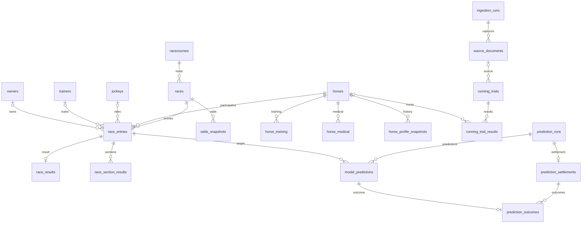

# DB 스키마·관계 및 Supabase 도입 검토 — 2026-09-14

실제 SQLite 시스템 카탈로그와 SQLAlchemy 모델, Alembic 마이그레이션을 대조한 읽기 전용 조사. Supabase는 프로젝트 목록과 공식 문서만 조회했으며 프로젝트 생성·기존 서버 DB 변경·자료 업로드를 수행하지 않았다.

## 현재 규모

- 업무 테이블 29개 + alembic_version 1개, 전체 9,111,608행, 332컬럼, 외래키 31개, 인덱스 56개(유니크 자동 인덱스 포함), 트리거 8개.
- DB 파일 935,067,648 bytes (약 935 MB / 892 MiB). 원문 data/raw 약 1.3 GiB, 실험 data/experiments 약 555 MiB는 별도 파일이다.
- SQLAlchemy 2 + Alembic, FastAPI/Jinja 웹. FK 검사 위반 0건. 모델과 실제 테이블 목록 차이 없음(관리 테이블 제외).
- SQLite main 공간에 모두 저장되어 있으며 현재 업무별 PostgreSQL schema 분리는 없다.

## 핵심 관계

실제 FK의 주요 관계만 그린 그림이다. 아래 테이블 사전에 전체 FK를 기록했다.

## 정리 방식 평가

- 핵심 경주 구조는 정규화되어 있다. 경기장별/거리별 테이블을 나누지 않고 races의 racecourse_id·distance_m·grade로 필터링한다.
- 경주 식별: 경기장+날짜+경주번호 UNIQUE. 출전 식별: 경주+출전번호 및 경주+말 UNIQUE. 결과: 출전당 1행. 구간: 출전+구간 UNIQUE.
- 날짜는 Date, 사건·관측시각은 epoch 밀리초 BigInteger, 기록은 밀리초 정수로 저장한다.
- 현재값(프로필·출전·결과), 관측 이력(레이팅·프로필·배당), 원문 파일과 수집 로그를 함께 사용한다. 모든 테이블이 버전별 불변 이력인 것은 아니다.
- 보강 자료와 주행심사의 meet_code는 racecourses FK가 아닌 공식 코드 값이다. 심판리포트·장구·기수변경 등은 race_id FK 없이 자연키로 조인한다. 정상 설계 선택이지만 DB가 경주 존재/매칭을 보장하지는 않는다.
- 대부분 결과 행은 SourceDocument에 직접 연결되지 않는다. 구간의 source_kind는 원천 종류이지 특정 문서 ID가 아니다. 더 강한 감사 추적이 필요하면 source_document_id/ingestion_run_id나 별도 provenance 테이블을 추가하는 편이 좋다.
- 회원·구독·결제·사용권한 테이블은 현재 없다. 유료/회원 서비스 단계에서 Auth와 별도 서비스 테이블 설계가 필요하다.

## Supabase 사용 가능 여부

사용 가능하며, 기존 Pro 조직 안에 경마 전용 새 프로젝트를 두는 것을 권장한다. 연결된 기존 프로젝트는 fintor, ap-northeast-2(서울), ACTIVE_HEALTHY, PostgreSQL 17이다. 조직의 실제 청구서·Compute 크기·사용량은 이번 조회 범위에 없으며 Pro 구독은 사용자 설명을 기준으로 했다.

같은 조직의 새 프로젝트는 별도 Postgres/컴퓨트와 Auth·Storage를 가진다. 같은 프로젝트 안의 별도 schema도 가능하지만 컴퓨트·백업/복구 단위·Auth·서비스 장애 영향을 공유한다. 독립 서비스이므로 새 프로젝트가 운영에 유리하다.

공식 요금표 확인 기준 Pro는 조직당 $25/월, 컴퓨트 크레딧 $10/월 포함. Micro $10/월이므로 기존과 신규가 모두 Micro이면 $25+$20-$10=$35/월(세금·추가사용·추가옵션 제외). 기존 구독 청구액에서 신규 Micro 약 $10/월 증가로 이해하는 것이 정확하다. 프로젝트별 DB 디스크 8GB 포함, 파일 Storage·네트워크 등은 조직 과금/할당량을 확인해야 한다.

현재 SQLite 파일은 1GB 미만이므로 시작 용량 면에서 가능성이 충분하지만 PostgreSQL의 인덱스·행 오버헤드·WAL을 포함한 실제 이관 크기는 측정해야 한다. 배당 테이블과 해당 인덱스만 약 489 MiB를 차지하므로 주기적 스냅샷 보관 정책과 조회 부하를 관리한다. Micro의 성능은 동시접속/쿼리/수집 부하 테스트 후 판정한다.

공식 근거: [요금표](https://supabase.com/pricing), [조직·다중 프로젝트 과금](https://supabase.com/docs/guides/platform/billing-faq).

## 이전 전에 필요한 수정

1. PostgreSQL 드라이버(psycopg 등) 추가. HORSE_RACING_DATABASE_URL을 통한 엔진 교체 구조는 이미 있으나 PostgreSQL 동작 테스트는 아직 없다.
2. horse_profile_snapshots.prize_money_total_krw: 현재 Integer인데 최대 5,137,450,000원, 57행이 int32 범위 초과. BigInteger로 변경해야 한다.
3. jockeys.kra_jockey_id 최대 36자, owners.kra_owner_id 최대 35자, trainers.kra_trainer_id 최대 37자. 모두 VARCHAR(30) 선언을 초과하는 text: 임시 ID가 있어 길이 확장 또는 공식/임시 키 구조 분리가 필요하다. 값을 잘라 옮기면 안 된다.
4. SQLite 전용 json_extract, strftime, unixepoch 날짜 처리와 Date에 적용한 substr를 PostgreSQL용 JSON/날짜 표현으로 교체한다. 관련 파일: services/race_day.py, cli.py, web/data_status.py, web/distance_page.py.
5. prediction_outcomes CHECK의 is_scored=1/0를 PostgreSQL Boolean에 맞게 변경. 예측 4테이블 UPDATE/DELETE 차단 트리거는 SQLite에서만 설치되므로 PostgreSQL에서도 같은 불변 보장을 구현해야 한다.
6. 원문 local_path는 서버 이전 후 그대로 사용할 수 없다. Supabase Storage 등 객체 저장소의 object key로 연결하고 수집·원문 재처리 경로를 수정한다. DB 백업은 Storage 파일 내용을 포함하지 않으므로 원본 백업은 따로 관리한다.
7. 전체 911만행은 COPY 등 일괄 적재, FK 순서 유지, PK 값 보존, sequence 재설정으로 옮긴다. 건수만 아니라 키·체크섬·대표 조인·시간 기준·증분 수집 재실행을 검증한다.
8. 수집은 대량 원격 왕복을 피하도록 배치 처리한다. 거리별 통계/전체 데이터 현황은 실제 쿼리 계획과 응답시간을 측정하고 필요한 집계 캐시·인덱스를 정한다. 연구용 전체 데이터 분석은 서비스 DB와 분리한 파일 스냅샷을 유지하는 편이 좋다.

관련 규칙: [PostgreSQL 정수 범위](https://www.postgresql.org/docs/current/datatype-numeric.html), [문자열 길이](https://www.postgresql.org/docs/current/datatype-character.html), [일괄 적재](https://supabase.com/docs/guides/database/import-data), [Storage와 DB 백업 범위](https://supabase.com/docs/guides/platform/backups).

## 권장 서비스 구성

브라우저 → 별도 배포한 FastAPI 웹/API 서버 → Supabase PostgreSQL. 예약 수집 worker → 동일 DB 및 private 원문 Storage. 연구/학습은 독립 실행 환경과 파일 스냅샷에서 수행. Supabase DB만 연결한다고 현재 Python 웹서버와 수집 프로세스까지 자동으로 배포되는 것은 아니다.

장기 실행 FastAPI는 direct connection 또는 IPv4 환경의 session pooler를 사용하고, 제한된 서버 전용 DB 계정·SSL·명시적 connection pool 제한을 설정한다. 서버리스라면 transaction pooler 제약을 별도 반영한다. 공개 API가 필요 없는 테이블은 비공개 schema와 제한된 DB 권한으로 운영한다. 브라우저 직접 조회가 필요해지면 노출 대상을 한정하고 GRANT와 RLS 정책을 함께 적용한다. 관리자 키를 브라우저에 두지 않는다.

[연결 방식](https://supabase.com/docs/guides/database/connecting-to-postgres), [Data API 보호](https://supabase.com/docs/guides/api/securing-your-api), [2026년 Data API 자동노출 변경](https://supabase.com/changelog/45329-breaking-change-tables-not-exposed-to-data-and-graphql-api-automatically).

실행 순서: 호환성 수정 → 별도 PostgreSQL 검증 → 경마 프로젝트 생성/권한 구성 → 전체 이관과 대조 → 웹·수집 worker 배포 → 마지막 증분 반영 후 서비스 연결 전환. 현재 턴은 검토 및 문서화까지이며 실제 이관은 미실행.

## 전체 테이블 사전

| 테이블 | 행 수 | 역할 |
|---|---:|---|
| `alembic_version` | 1 | DB 마이그레이션 적용 버전. 현재 20260908_0010. |
| `entry_equipment` | 44,803 | 출전 장구·폐출혈·질환 비고. 말 FK 및 경주 자연키로 연결. |
| `horse_grade_changes` | 13,457 | 말의 등급 변경 이력. |
| `horse_medical` | 176,811 | 말의 진료·진단 이력. |
| `horse_profile_snapshots` | 94,854 | 말×관측시각별 등급·전적·누적상금·관계자 원문 스냅샷. |
| `horse_rating_snapshots` | 206,505 | 말×관측시각별 레이팅 스냅샷. |
| `horse_start_training` | 70,068 | 말의 출발훈련 이력. |
| `horse_training` | 752,358 | 말의 일별 일반 훈련과 운동 이력. |
| `horse_weight_history` | 44,803 | 말의 경주일별 체중 이력. 경기장·날짜·경주번호로 출전과 논리 연결. |
| `horses` | 60,645 | 말의 공통 프로필. 내부 ID와 공식 마번을 분리하고 모든 출전·이력에서 재사용. |
| `ingestion_runs` | 15,307 | 수집 실행별 상태·시각·건수·오류. |
| `jockey_changes` | 887 | 출전별 기수 변경. 경주/출전 FK 대신 경기장·날짜·경주번호·출전번호 사용. |
| `jockeys` | 294 | 기수 기준정보. 과거 원문에서 생성된 text: 임시 식별자도 포함. |
| `model_predictions` | 326 | 공개 실행별 출전마의 승리/복승권/삼복승권 확률. |
| `odds_snapshots` | 5,639,948 | 경주×승식×조합×관측시각별 배당. 현재 수집은 확정배당 중심이며 재관측 시 행이 추가될 수 있음. |
| `owners` | 1,487 | 마주 기준정보. 공식/임시 식별자 포함. |
| `prediction_outcomes` | 0 | 예측별 사후 실제 결과 라벨. 현재 0행. |
| `prediction_runs` | 2 | 공개 예측 실행. 모델·데이터 버전·공개시각·해시를 보관. |
| `prediction_settlements` | 0 | 공개 예측 실행별 사후 평가 집계. 현재 0행. |
| `race_entries` | 288,606 | 한 경주에 출전한 말 1두. 말·기수·조교사·마주 연결, 출전번호·게이트·부담중량. |
| `race_results` | 288,606 | 출전 1건의 최종 결과. 순위·전체시간·상금·비고. 출전별 최대 1행. |
| `race_scratches` | 534 | 출전취소 내역. 말 FK 및 경주 자연키로 연결. |
| `race_section_results` | 1,334,304 | 출전×구간 코드별 시간·통과순위. 누적/막판(time_basis), 원천 종류(source_kind). |
| `race_steward_reports` | 4,251 | 경주별 심판리포트. 경주 FK 없이 경기장·날짜·번호로 연결. |
| `racecourses` | 4 | 경기장 기준정보. KRA 코드 1 서울, 2 제주, 3 부산경남, 4 영천. |
| `races` | 27,129 | 한 경기장의 특정 날짜·경주번호 1개. 거리·등급·조건·날씨·상태. |
| `running_trial_results` | 8,680 | 주행심사별 말 결과 및 구간 시간. 말·기수·조교사 FK, 미식별 원문도 보관. |
| `running_trials` | 865 | 주행심사 1회. 공식경주와 별도 관리, 원문 문서 FK. |
| `source_documents` | 35,519 | 수집한 원문 출처·요청조건·파일경로·SHA256. 원본 파일 자체는 DB 밖에 있음. |
| `trainers` | 554 | 조교사 기준정보. 공식/임시 식별자 포함. |

### alembic_version

DB 마이그레이션 적용 버전. 현재 20260908_0010.

| 컬럼 | 자료형 | NULL 허용 | PK |
|---|---|---|---|
| `version_num` | `VARCHAR(32)` | 아니오 | 1 |

외래키:

없음.

인덱스/유니크:

- `sqlite_autoindex_alembic_version_1`: version_num; UNIQUE.

### entry_equipment

출전 장구·폐출혈·질환 비고. 말 FK 및 경주 자연키로 연결.

| 컬럼 | 자료형 | NULL 허용 | PK |
|---|---|---|---|
| `id` | `INTEGER` | 아니오 | 1 |
| `horse_id` | `INTEGER` | 예 |  |
| `meet_code` | `INTEGER` | 아니오 |  |
| `race_date_local` | `DATE` | 아니오 |  |
| `race_number` | `INTEGER` | 아니오 |  |
| `horse_number` | `INTEGER` | 예 |  |
| `equipment_raw` | `VARCHAR(200)` | 예 |  |
| `bleeding_count` | `INTEGER` | 예 |  |
| `bleeding_date_raw` | `VARCHAR(40)` | 예 |  |
| `illness_note` | `VARCHAR(200)` | 예 |  |
| `observed_at_ms` | `BIGINT` | 아니오 |  |

외래키:

- `horse_id` → `horses.id`; 삭제 시 `SET NULL`.

인덱스/유니크:

- `ix_entry_equipment_horse_date`: horse_id, race_date_local; 일반.
- `sqlite_autoindex_entry_equipment_1`: meet_code, race_date_local, race_number, horse_number; UNIQUE.

### horse_grade_changes

말의 등급 변경 이력.

| 컬럼 | 자료형 | NULL 허용 | PK |
|---|---|---|---|
| `id` | `INTEGER` | 아니오 | 1 |
| `horse_id` | `INTEGER` | 아니오 |  |
| `meet_code` | `INTEGER` | 예 |  |
| `blood_type` | `VARCHAR(50)` | 예 |  |
| `grade_before` | `VARCHAR(30)` | 예 |  |
| `grade_after` | `VARCHAR(30)` | 예 |  |
| `start_date_local` | `DATE` | 예 |  |
| `end_date_local` | `DATE` | 예 |  |
| `observed_at_ms` | `BIGINT` | 아니오 |  |

외래키:

- `horse_id` → `horses.id`; 삭제 시 `CASCADE`.

인덱스/유니크:

- `ix_horse_grade_changes_horse_start`: horse_id, start_date_local; 일반.
- `sqlite_autoindex_horse_grade_changes_1`: horse_id, start_date_local, grade_before, grade_after; UNIQUE.

### horse_medical

말의 진료·진단 이력.

| 컬럼 | 자료형 | NULL 허용 | PK |
|---|---|---|---|
| `id` | `INTEGER` | 아니오 | 1 |
| `horse_id` | `INTEGER` | 아니오 |  |
| `meet_code` | `INTEGER` | 아니오 |  |
| `clinic_date_local` | `DATE` | 아니오 |  |
| `stable_part` | `INTEGER` | 예 |  |
| `hospital_name` | `VARCHAR(100)` | 예 |  |
| `diagnosis_1` | `VARCHAR(200)` | 예 |  |
| `diagnosis_2` | `VARCHAR(200)` | 예 |  |
| `observed_at_ms` | `BIGINT` | 아니오 |  |

외래키:

- `horse_id` → `horses.id`; 삭제 시 `CASCADE`.

인덱스/유니크:

- `ix_horse_medical_horse_date`: horse_id, clinic_date_local; 일반.
- `sqlite_autoindex_horse_medical_1`: horse_id, meet_code, clinic_date_local, hospital_name, diagnosis_1, diagnosis_2; UNIQUE.

### horse_profile_snapshots

말×관측시각별 등급·전적·누적상금·관계자 원문 스냅샷.

| 컬럼 | 자료형 | NULL 허용 | PK |
|---|---|---|---|
| `id` | `INTEGER` | 아니오 | 1 |
| `horse_id` | `INTEGER` | 아니오 |  |
| `meet_code` | `INTEGER` | 예 |  |
| `grade` | `VARCHAR(30)` | 예 |  |
| `rating` | `FLOAT` | 예 |  |
| `race_count_total` | `INTEGER` | 예 |  |
| `race_count_year` | `INTEGER` | 예 |  |
| `win_count_total` | `INTEGER` | 예 |  |
| `win_count_year` | `INTEGER` | 예 |  |
| `second_count_total` | `INTEGER` | 예 |  |
| `second_count_year` | `INTEGER` | 예 |  |
| `third_count_total` | `INTEGER` | 예 |  |
| `third_count_year` | `INTEGER` | 예 |  |
| `prize_money_total_krw` | `INTEGER` | 예 |  |
| `last_sale_amount_raw` | `VARCHAR(100)` | 예 |  |
| `trainer_kra_id` | `VARCHAR(30)` | 예 |  |
| `trainer_name` | `VARCHAR(100)` | 예 |  |
| `owner_kra_id` | `VARCHAR(30)` | 예 |  |
| `owner_name` | `VARCHAR(100)` | 예 |  |
| `observed_at_ms` | `BIGINT` | 아니오 |  |

외래키:

- `horse_id` → `horses.id`; 삭제 시 `CASCADE`.

인덱스/유니크:

- `ix_horse_profile_snapshots_horse_observed`: horse_id, observed_at_ms; 일반.
- `sqlite_autoindex_horse_profile_snapshots_1`: horse_id, observed_at_ms; UNIQUE.

### horse_rating_snapshots

말×관측시각별 레이팅 스냅샷.

| 컬럼 | 자료형 | NULL 허용 | PK |
|---|---|---|---|
| `id` | `INTEGER` | 아니오 | 1 |
| `horse_id` | `INTEGER` | 아니오 |  |
| `meet_code` | `INTEGER` | 예 |  |
| `rating_1` | `FLOAT` | 예 |  |
| `rating_2` | `FLOAT` | 예 |  |
| `rating_3` | `FLOAT` | 예 |  |
| `rating_4` | `FLOAT` | 예 |  |
| `observed_at_ms` | `BIGINT` | 아니오 |  |

외래키:

- `horse_id` → `horses.id`; 삭제 시 `CASCADE`.

인덱스/유니크:

- `ix_horse_rating_snapshots_horse_observed`: horse_id, observed_at_ms; 일반.
- `sqlite_autoindex_horse_rating_snapshots_1`: horse_id, observed_at_ms; UNIQUE.

### horse_start_training

말의 출발훈련 이력.

| 컬럼 | 자료형 | NULL 허용 | PK |
|---|---|---|---|
| `id` | `INTEGER` | 아니오 | 1 |
| `horse_id` | `INTEGER` | 아니오 |  |
| `meet_code` | `INTEGER` | 아니오 |  |
| `training_date_local` | `DATE` | 아니오 |  |
| `stable_part` | `INTEGER` | 예 |  |
| `stable_number` | `INTEGER` | 예 |  |
| `rider_name` | `VARCHAR(100)` | 예 |  |
| `remark` | `VARCHAR(200)` | 예 |  |
| `observed_at_ms` | `BIGINT` | 아니오 |  |

외래키:

- `horse_id` → `horses.id`; 삭제 시 `CASCADE`.

인덱스/유니크:

- `ix_horse_start_training_horse_date`: horse_id, training_date_local; 일반.
- `sqlite_autoindex_horse_start_training_1`: horse_id, meet_code, training_date_local, stable_part, stable_number, rider_name; UNIQUE.

### horse_training

말의 일별 일반 훈련과 운동 이력.

| 컬럼 | 자료형 | NULL 허용 | PK |
|---|---|---|---|
| `id` | `INTEGER` | 아니오 | 1 |
| `horse_id` | `INTEGER` | 아니오 |  |
| `meet_code` | `INTEGER` | 아니오 |  |
| `training_date_local` | `DATE` | 아니오 |  |
| `stable_part` | `INTEGER` | 예 |  |
| `stable_number` | `INTEGER` | 예 |  |
| `trainer_name` | `VARCHAR(100)` | 예 |  |
| `rider_type` | `VARCHAR(30)` | 예 |  |
| `rider_id` | `VARCHAR(30)` | 예 |  |
| `started_at_raw` | `VARCHAR(20)` | 예 |  |
| `ended_at_raw` | `VARCHAR(20)` | 예 |  |
| `duration_seconds` | `INTEGER` | 예 |  |
| `canter_count` | `INTEGER` | 예 |  |
| `gallop_count` | `INTEGER` | 예 |  |
| `entry_plan` | `VARCHAR(50)` | 예 |  |
| `observed_at_ms` | `BIGINT` | 아니오 |  |

외래키:

- `horse_id` → `horses.id`; 삭제 시 `CASCADE`.

인덱스/유니크:

- `ix_horse_training_horse_date`: horse_id, training_date_local; 일반.
- `sqlite_autoindex_horse_training_1`: horse_id, meet_code, training_date_local, started_at_raw, ended_at_raw; UNIQUE.

### horse_weight_history

말의 경주일별 체중 이력. 경기장·날짜·경주번호로 출전과 논리 연결.

| 컬럼 | 자료형 | NULL 허용 | PK |
|---|---|---|---|
| `id` | `INTEGER` | 아니오 | 1 |
| `horse_id` | `INTEGER` | 아니오 |  |
| `meet_code` | `INTEGER` | 아니오 |  |
| `race_date_local` | `DATE` | 아니오 |  |
| `race_number` | `INTEGER` | 예 |  |
| `horse_number` | `INTEGER` | 예 |  |
| `body_weight_kg` | `INTEGER` | 예 |  |
| `body_weight_change_kg` | `INTEGER` | 예 |  |
| `observed_at_ms` | `BIGINT` | 아니오 |  |

외래키:

- `horse_id` → `horses.id`; 삭제 시 `CASCADE`.

인덱스/유니크:

- `ix_horse_weight_history_horse_date`: horse_id, race_date_local; 일반.
- `sqlite_autoindex_horse_weight_history_1`: horse_id, meet_code, race_date_local, race_number, horse_number; UNIQUE.

### horses

말의 공통 프로필. 내부 ID와 공식 마번을 분리하고 모든 출전·이력에서 재사용.

| 컬럼 | 자료형 | NULL 허용 | PK |
|---|---|---|---|
| `id` | `INTEGER` | 아니오 | 1 |
| `kra_horse_id` | `VARCHAR(30)` | 아니오 |  |
| `name_ko` | `VARCHAR(100)` | 아니오 |  |
| `name_en` | `VARCHAR(150)` | 예 |  |
| `sex` | `VARCHAR(20)` | 예 |  |
| `birth_date` | `DATE` | 예 |  |
| `origin_country` | `VARCHAR(50)` | 예 |  |
| `grade` | `VARCHAR(30)` | 예 |  |
| `meet_code` | `INTEGER` | 예 |  |
| `sire_kra_id` | `VARCHAR(30)` | 예 |  |
| `sire_name` | `VARCHAR(100)` | 예 |  |
| `dam_kra_id` | `VARCHAR(30)` | 예 |  |
| `dam_name` | `VARCHAR(100)` | 예 |  |
| `last_sale_amount_raw` | `VARCHAR(100)` | 예 |  |
| `profile_observed_at_ms` | `BIGINT` | 예 |  |

외래키:

없음.

인덱스/유니크:

- `sqlite_autoindex_horses_1`: kra_horse_id; UNIQUE.

### ingestion_runs

수집 실행별 상태·시각·건수·오류.

| 컬럼 | 자료형 | NULL 허용 | PK |
|---|---|---|---|
| `id` | `INTEGER` | 아니오 | 1 |
| `source` | `VARCHAR(100)` | 아니오 |  |
| `data_type` | `VARCHAR(100)` | 아니오 |  |
| `started_at_ms` | `BIGINT` | 아니오 |  |
| `completed_at_ms` | `BIGINT` | 예 |  |
| `status` | `VARCHAR(20)` | 아니오 |  |
| `records_fetched` | `INTEGER` | 아니오 |  |
| `records_written` | `INTEGER` | 아니오 |  |
| `error_message` | `TEXT` | 예 |  |

외래키:

없음.

인덱스/유니크:

명시/자동 인덱스 없음(PK rowid 제외).

### jockey_changes

출전별 기수 변경. 경주/출전 FK 대신 경기장·날짜·경주번호·출전번호 사용.

| 컬럼 | 자료형 | NULL 허용 | PK |
|---|---|---|---|
| `id` | `INTEGER` | 아니오 | 1 |
| `horse_id` | `INTEGER` | 예 |  |
| `meet_code` | `INTEGER` | 아니오 |  |
| `race_date_local` | `DATE` | 아니오 |  |
| `race_number` | `INTEGER` | 아니오 |  |
| `horse_number` | `INTEGER` | 아니오 |  |
| `jockey_before_id` | `VARCHAR(30)` | 예 |  |
| `jockey_before_name` | `VARCHAR(100)` | 예 |  |
| `jockey_after_id` | `VARCHAR(30)` | 예 |  |
| `jockey_after_name` | `VARCHAR(100)` | 예 |  |
| `carried_weight_before_kg` | `FLOAT` | 예 |  |
| `carried_weight_after_kg` | `FLOAT` | 예 |  |
| `reason` | `VARCHAR(200)` | 예 |  |
| `observed_at_ms` | `BIGINT` | 아니오 |  |

외래키:

- `horse_id` → `horses.id`; 삭제 시 `SET NULL`.

인덱스/유니크:

- `ix_jockey_changes_date_meet`: race_date_local, meet_code; 일반.
- `sqlite_autoindex_jockey_changes_1`: meet_code, race_date_local, race_number, horse_number, jockey_before_id, jockey_after_id; UNIQUE.

### jockeys

기수 기준정보. 과거 원문에서 생성된 text: 임시 식별자도 포함.

| 컬럼 | 자료형 | NULL 허용 | PK |
|---|---|---|---|
| `id` | `INTEGER` | 아니오 | 1 |
| `kra_jockey_id` | `VARCHAR(30)` | 아니오 |  |
| `name_ko` | `VARCHAR(100)` | 아니오 |  |
| `name_en` | `VARCHAR(150)` | 예 |  |

외래키:

없음.

인덱스/유니크:

- `sqlite_autoindex_jockeys_1`: kra_jockey_id; UNIQUE.

### model_predictions

공개 실행별 출전마의 승리/복승권/삼복승권 확률.

| 컬럼 | 자료형 | NULL 허용 | PK |
|---|---|---|---|
| `id` | `INTEGER` | 아니오 | 1 |
| `prediction_run_id` | `INTEGER` | 아니오 |  |
| `race_id` | `INTEGER` | 아니오 |  |
| `race_entry_id` | `INTEGER` | 아니오 |  |
| `horse_number` | `INTEGER` | 아니오 |  |
| `prob_win` | `FLOAT` | 아니오 |  |
| `prob_top2` | `FLOAT` | 아니오 |  |
| `prob_top3` | `FLOAT` | 아니오 |  |

외래키:

- `race_id` → `races.id`; 삭제 시 `RESTRICT`.
- `race_entry_id` → `race_entries.id`; 삭제 시 `RESTRICT`.
- `prediction_run_id` → `prediction_runs.id`; 삭제 시 `RESTRICT`.

인덱스/유니크:

- `ix_model_predictions_race`: race_id, prediction_run_id; 일반.
- `sqlite_autoindex_model_predictions_1`: prediction_run_id, race_entry_id; UNIQUE.

### odds_snapshots

경주×승식×조합×관측시각별 배당. 현재 수집은 확정배당 중심이며 재관측 시 행이 추가될 수 있음.

| 컬럼 | 자료형 | NULL 허용 | PK |
|---|---|---|---|
| `id` | `INTEGER` | 아니오 | 1 |
| `race_id` | `INTEGER` | 아니오 |  |
| `bet_type` | `VARCHAR(30)` | 아니오 |  |
| `selection_key` | `VARCHAR(50)` | 아니오 |  |
| `odds` | `FLOAT` | 아니오 |  |
| `observed_at_ms` | `BIGINT` | 아니오 |  |

외래키:

- `race_id` → `races.id`; 삭제 시 `CASCADE`.

인덱스/유니크:

- `ix_odds_snapshots_race_time`: race_id, observed_at_ms; 일반.
- `sqlite_autoindex_odds_snapshots_1`: race_id, bet_type, selection_key, observed_at_ms; UNIQUE.

### owners

마주 기준정보. 공식/임시 식별자 포함.

| 컬럼 | 자료형 | NULL 허용 | PK |
|---|---|---|---|
| `id` | `INTEGER` | 아니오 | 1 |
| `kra_owner_id` | `VARCHAR(30)` | 아니오 |  |
| `name_ko` | `VARCHAR(100)` | 아니오 |  |
| `name_en` | `VARCHAR(150)` | 예 |  |

외래키:

없음.

인덱스/유니크:

- `sqlite_autoindex_owners_1`: kra_owner_id; UNIQUE.

### prediction_outcomes

예측별 사후 실제 결과 라벨. 현재 0행.

| 컬럼 | 자료형 | NULL 허용 | PK |
|---|---|---|---|
| `id` | `INTEGER` | 아니오 | 1 |
| `settlement_id` | `INTEGER` | 아니오 |  |
| `model_prediction_id` | `INTEGER` | 아니오 |  |
| `finish_position` | `INTEGER` | 예 |  |
| `is_scored` | `BOOLEAN` | 아니오 |  |
| `exclusion_reason` | `VARCHAR(100)` | 예 |  |
| `win` | `BOOLEAN` | 예 |  |
| `top2` | `BOOLEAN` | 예 |  |
| `top3` | `BOOLEAN` | 예 |  |
| `win_log_loss` | `FLOAT` | 예 |  |

외래키:

- `settlement_id` → `prediction_settlements.id`; 삭제 시 `RESTRICT`.
- `model_prediction_id` → `model_predictions.id`; 삭제 시 `RESTRICT`.

인덱스/유니크:

- `ix_prediction_outcomes_settlement`: settlement_id; 일반.
- `sqlite_autoindex_prediction_outcomes_1`: model_prediction_id; UNIQUE.

### prediction_runs

공개 예측 실행. 모델·데이터 버전·공개시각·해시를 보관.

| 컬럼 | 자료형 | NULL 허용 | PK |
|---|---|---|---|
| `id` | `INTEGER` | 아니오 | 1 |
| `public_id` | `VARCHAR(36)` | 아니오 |  |
| `experiment_run_id` | `VARCHAR(36)` | 아니오 |  |
| `model_type` | `VARCHAR(100)` | 아니오 |  |
| `dataset_version` | `VARCHAR(100)` | 아니오 |  |
| `as_of_policy` | `VARCHAR(50)` | 아니오 |  |
| `race_date_local` | `DATE` | 아니오 |  |
| `feature_cutoff_at_ms` | `BIGINT` | 아니오 |  |
| `published_at_ms` | `BIGINT` | 아니오 |  |
| `publication_mode` | `VARCHAR(20)` | 아니오 |  |
| `model_artifact_sha256` | `VARCHAR(64)` | 아니오 |  |
| `feature_hash` | `VARCHAR(64)` | 아니오 |  |
| `predictions_sha256` | `VARCHAR(64)` | 아니오 |  |
| `notes` | `TEXT` | 예 |  |

외래키:

없음.

인덱스/유니크:

- `ix_prediction_runs_date_mode`: race_date_local, publication_mode; 일반.
- `sqlite_autoindex_prediction_runs_2`: public_id; UNIQUE.
- `sqlite_autoindex_prediction_runs_1`: predictions_sha256; UNIQUE.

### prediction_settlements

공개 예측 실행별 사후 평가 집계. 현재 0행.

| 컬럼 | 자료형 | NULL 허용 | PK |
|---|---|---|---|
| `id` | `INTEGER` | 아니오 | 1 |
| `public_id` | `VARCHAR(36)` | 아니오 |  |
| `prediction_run_id` | `INTEGER` | 아니오 |  |
| `settled_at_ms` | `BIGINT` | 아니오 |  |
| `outcomes_sha256` | `VARCHAR(64)` | 아니오 |  |
| `n_races` | `INTEGER` | 아니오 |  |
| `n_entries` | `INTEGER` | 아니오 |  |
| `n_excluded_races` | `INTEGER` | 아니오 |  |
| `win_log_loss` | `FLOAT` | 아니오 |  |
| `win_brier` | `FLOAT` | 아니오 |  |
| `win_ece` | `FLOAT` | 아니오 |  |
| `win_top1_hit_rate` | `FLOAT` | 아니오 |  |
| `win_top3_inclusion_rate` | `FLOAT` | 아니오 |  |
| `top2_log_loss` | `FLOAT` | 아니오 |  |
| `top3_log_loss` | `FLOAT` | 아니오 |  |

외래키:

- `prediction_run_id` → `prediction_runs.id`; 삭제 시 `RESTRICT`.

인덱스/유니크:

- `ix_prediction_settlements_settled`: settled_at_ms; 일반.
- `sqlite_autoindex_prediction_settlements_3`: public_id; UNIQUE.
- `sqlite_autoindex_prediction_settlements_2`: prediction_run_id; UNIQUE.
- `sqlite_autoindex_prediction_settlements_1`: outcomes_sha256; UNIQUE.

### race_entries

한 경주에 출전한 말 1두. 말·기수·조교사·마주 연결, 출전번호·게이트·부담중량.

| 컬럼 | 자료형 | NULL 허용 | PK |
|---|---|---|---|
| `id` | `INTEGER` | 아니오 | 1 |
| `race_id` | `INTEGER` | 아니오 |  |
| `horse_id` | `INTEGER` | 아니오 |  |
| `jockey_id` | `INTEGER` | 예 |  |
| `trainer_id` | `INTEGER` | 예 |  |
| `owner_id` | `INTEGER` | 예 |  |
| `horse_number` | `INTEGER` | 아니오 |  |
| `gate_number` | `INTEGER` | 예 |  |
| `carried_weight_kg` | `FLOAT` | 예 |  |
| `body_weight_kg` | `INTEGER` | 예 |  |
| `body_weight_change_kg` | `INTEGER` | 예 |  |
| `rating` | `FLOAT` | 예 |  |
| `running_style` | `VARCHAR(30)` | 예 |  |
| `scratched` | `BOOLEAN` | 아니오 |  |
| `equipment` | `TEXT` | 예 |  |

외래키:

- `owner_id` → `owners.id`; 삭제 시 `NO ACTION`.
- `trainer_id` → `trainers.id`; 삭제 시 `NO ACTION`.
- `jockey_id` → `jockeys.id`; 삭제 시 `NO ACTION`.
- `horse_id` → `horses.id`; 삭제 시 `RESTRICT`.
- `race_id` → `races.id`; 삭제 시 `CASCADE`.

인덱스/유니크:

- `ix_race_entries_horse_race`: horse_id, race_id; 일반.
- `sqlite_autoindex_race_entries_2`: race_id, horse_id; UNIQUE.
- `sqlite_autoindex_race_entries_1`: race_id, horse_number; UNIQUE.

### race_results

출전 1건의 최종 결과. 순위·전체시간·상금·비고. 출전별 최대 1행.

| 컬럼 | 자료형 | NULL 허용 | PK |
|---|---|---|---|
| `id` | `INTEGER` | 아니오 | 1 |
| `race_entry_id` | `INTEGER` | 아니오 |  |
| `finish_position` | `INTEGER` | 예 |  |
| `finish_time_ms` | `INTEGER` | 예 |  |
| `margin_text` | `VARCHAR(50)` | 예 |  |
| `prize_money_krw` | `BIGINT` | 예 |  |
| `disqualified` | `BOOLEAN` | 아니오 |  |
| `bonus_prize_money_krw` | `BIGINT` | 예 |  |
| `rank_remark` | `VARCHAR(200)` | 예 |  |

외래키:

- `race_entry_id` → `race_entries.id`; 삭제 시 `CASCADE`.

인덱스/유니크:

- `sqlite_autoindex_race_results_1`: race_entry_id; UNIQUE.

### race_scratches

출전취소 내역. 말 FK 및 경주 자연키로 연결.

| 컬럼 | 자료형 | NULL 허용 | PK |
|---|---|---|---|
| `id` | `INTEGER` | 아니오 | 1 |
| `horse_id` | `INTEGER` | 예 |  |
| `meet_code` | `INTEGER` | 아니오 |  |
| `race_date_local` | `DATE` | 아니오 |  |
| `race_number` | `INTEGER` | 아니오 |  |
| `horse_number` | `INTEGER` | 예 |  |
| `reason` | `VARCHAR(200)` | 예 |  |
| `observed_at_ms` | `BIGINT` | 아니오 |  |

외래키:

- `horse_id` → `horses.id`; 삭제 시 `SET NULL`.

인덱스/유니크:

- `ix_race_scratches_date_meet`: race_date_local, meet_code; 일반.
- `sqlite_autoindex_race_scratches_1`: meet_code, race_date_local, race_number, horse_id; UNIQUE.

### race_section_results

출전×구간 코드별 시간·통과순위. 누적/막판(time_basis), 원천 종류(source_kind).

| 컬럼 | 자료형 | NULL 허용 | PK |
|---|---|---|---|
| `id` | `INTEGER` | 아니오 | 1 |
| `race_entry_id` | `INTEGER` | 아니오 |  |
| `section_code` | `VARCHAR(20)` | 아니오 |  |
| `distance_from_start_m` | `INTEGER` | 예 |  |
| `elapsed_time_ms` | `INTEGER` | 예 |  |
| `position` | `INTEGER` | 예 |  |
| `gap_to_leader_lengths` | `FLOAT` | 예 |  |
| `group_notation_raw` | `TEXT` | 예 |  |
| `time_basis` | `VARCHAR(20)` | 예 |  |
| `source_kind` | `VARCHAR(30)` | 예 |  |

외래키:

- `race_entry_id` → `race_entries.id`; 삭제 시 `CASCADE`.

인덱스/유니크:

- `ix_race_section_results_code`: section_code; 일반.
- `sqlite_autoindex_race_section_results_1`: race_entry_id, section_code; UNIQUE.

### race_steward_reports

경주별 심판리포트. 경주 FK 없이 경기장·날짜·번호로 연결.

| 컬럼 | 자료형 | NULL 허용 | PK |
|---|---|---|---|
| `id` | `INTEGER` | 아니오 | 1 |
| `meet_code` | `INTEGER` | 아니오 |  |
| `race_date_local` | `DATE` | 아니오 |  |
| `race_number` | `INTEGER` | 아니오 |  |
| `weather` | `VARCHAR(100)` | 예 |  |
| `members` | `TEXT` | 예 |  |
| `judgement` | `TEXT` | 예 |  |
| `additional_judgement` | `TEXT` | 예 |  |
| `jockey_change_note` | `TEXT` | 예 |  |
| `observed_at_ms` | `BIGINT` | 아니오 |  |

외래키:

없음.

인덱스/유니크:

- `ix_race_steward_reports_date_meet`: race_date_local, meet_code; 일반.
- `sqlite_autoindex_race_steward_reports_1`: meet_code, race_date_local, race_number; UNIQUE.

### racecourses

경기장 기준정보. KRA 코드 1 서울, 2 제주, 3 부산경남, 4 영천.

| 컬럼 | 자료형 | NULL 허용 | PK |
|---|---|---|---|
| `id` | `INTEGER` | 아니오 | 1 |
| `kra_meet_code` | `INTEGER` | 아니오 |  |
| `code` | `VARCHAR(30)` | 아니오 |  |
| `name_ko` | `VARCHAR(50)` | 아니오 |  |
| `name_en` | `VARCHAR(100)` | 예 |  |

외래키:

없음.

인덱스/유니크:

- `sqlite_autoindex_racecourses_2`: code; UNIQUE.
- `sqlite_autoindex_racecourses_1`: kra_meet_code; UNIQUE.

### races

한 경기장의 특정 날짜·경주번호 1개. 거리·등급·조건·날씨·상태.

| 컬럼 | 자료형 | NULL 허용 | PK |
|---|---|---|---|
| `id` | `INTEGER` | 아니오 | 1 |
| `racecourse_id` | `INTEGER` | 아니오 |  |
| `race_date_local` | `DATE` | 아니오 |  |
| `race_number` | `INTEGER` | 아니오 |  |
| `distance_m` | `INTEGER` | 아니오 |  |
| `grade` | `VARCHAR(50)` | 예 |  |
| `race_name` | `VARCHAR(200)` | 예 |  |
| `scheduled_at_ms` | `BIGINT` | 예 |  |
| `weather` | `VARCHAR(30)` | 예 |  |
| `track_condition` | `VARCHAR(30)` | 예 |  |
| `track_moisture_percent` | `FLOAT` | 예 |  |
| `status` | `VARCHAR(20)` | 아니오 |  |
| `race_day_count` | `INTEGER` | 예 |  |
| `field_size` | `INTEGER` | 예 |  |
| `burden_type` | `VARCHAR(50)` | 예 |  |
| `age_condition` | `VARCHAR(100)` | 예 |  |
| `sex_condition` | `VARCHAR(100)` | 예 |  |
| `rating_condition` | `VARCHAR(100)` | 예 |  |
| `newcomer_condition` | `VARCHAR(100)` | 예 |  |
| `actual_start_at_ms` | `BIGINT` | 예 |  |
| `start_time_change_reason` | `VARCHAR(300)` | 예 |  |
| `weather_planned` | `VARCHAR(30)` | 예 |  |
| `track_condition_planned` | `VARCHAR(30)` | 예 |  |
| `track_moisture_percent_planned` | `FLOAT` | 예 |  |

외래키:

- `racecourse_id` → `racecourses.id`; 삭제 시 `RESTRICT`.

인덱스/유니크:

- `ix_races_date_course`: race_date_local, racecourse_id; 일반.
- `sqlite_autoindex_races_1`: racecourse_id, race_date_local, race_number; UNIQUE.

### running_trial_results

주행심사별 말 결과 및 구간 시간. 말·기수·조교사 FK, 미식별 원문도 보관.

| 컬럼 | 자료형 | NULL 허용 | PK |
|---|---|---|---|
| `id` | `INTEGER` | 아니오 | 1 |
| `running_trial_id` | `INTEGER` | 아니오 |  |
| `horse_id` | `INTEGER` | 예 |  |
| `jockey_id` | `INTEGER` | 예 |  |
| `trainer_id` | `INTEGER` | 예 |  |
| `horse_number` | `INTEGER` | 아니오 |  |
| `horse_name_raw` | `VARCHAR(100)` | 아니오 |  |
| `finish_position` | `INTEGER` | 예 |  |
| `finish_rank_raw` | `VARCHAR(10)` | 예 |  |
| `origin_country` | `VARCHAR(30)` | 예 |  |
| `sex` | `VARCHAR(20)` | 예 |  |
| `age` | `INTEGER` | 예 |  |
| `carried_weight_base_kg` | `FLOAT` | 예 |  |
| `carried_weight_extra_kg` | `FLOAT` | 예 |  |
| `carried_weight_raw` | `VARCHAR(30)` | 예 |  |
| `jockey_name_raw` | `VARCHAR(100)` | 예 |  |
| `trainer_name_raw` | `VARCHAR(100)` | 예 |  |
| `body_weight_kg` | `INTEGER` | 예 |  |
| `finish_time_ms` | `INTEGER` | 예 |  |
| `margin_text` | `VARCHAR(50)` | 예 |  |
| `judgement` | `VARCHAR(20)` | 예 |  |
| `failure_reason` | `VARCHAR(100)` | 예 |  |
| `inspection_reason` | `VARCHAR(150)` | 예 |  |
| `g3f_ms` | `INTEGER` | 예 |  |
| `s1f_ms` | `INTEGER` | 예 |  |
| `corner_3_ms` | `INTEGER` | 예 |  |
| `corner_4_ms` | `INTEGER` | 예 |  |
| `g1f_ms` | `INTEGER` | 예 |  |
| `section_400_ms` | `INTEGER` | 예 |  |
| `final_400_ms` | `INTEGER` | 예 |  |
| `passing_order_raw` | `VARCHAR(100)` | 예 |  |
| `observed_at_ms` | `BIGINT` | 아니오 |  |

외래키:

- `trainer_id` → `trainers.id`; 삭제 시 `SET NULL`.
- `running_trial_id` → `running_trials.id`; 삭제 시 `CASCADE`.
- `jockey_id` → `jockeys.id`; 삭제 시 `SET NULL`.
- `horse_id` → `horses.id`; 삭제 시 `SET NULL`.

인덱스/유니크:

- `ix_running_trial_results_horse_trial`: horse_id, running_trial_id; 일반.
- `sqlite_autoindex_running_trial_results_1`: running_trial_id, horse_number; UNIQUE.

### running_trials

주행심사 1회. 공식경주와 별도 관리, 원문 문서 FK.

| 컬럼 | 자료형 | NULL 허용 | PK |
|---|---|---|---|
| `id` | `INTEGER` | 아니오 | 1 |
| `source_document_id` | `INTEGER` | 예 |  |
| `meet_code` | `INTEGER` | 아니오 |  |
| `trial_date_local` | `DATE` | 아니오 |  |
| `trial_round` | `INTEGER` | 예 |  |
| `trial_race_number` | `INTEGER` | 아니오 |  |
| `distance_m` | `INTEGER` | 아니오 |  |
| `weather` | `VARCHAR(30)` | 예 |  |
| `track_condition` | `VARCHAR(30)` | 예 |  |
| `track_moisture_percent` | `FLOAT` | 예 |  |
| `observed_at_ms` | `BIGINT` | 아니오 |  |

외래키:

- `source_document_id` → `source_documents.id`; 삭제 시 `SET NULL`.

인덱스/유니크:

- `ix_running_trials_date_meet`: trial_date_local, meet_code; 일반.
- `sqlite_autoindex_running_trials_1`: meet_code, trial_date_local, trial_race_number; UNIQUE.

### source_documents

수집한 원문 출처·요청조건·파일경로·SHA256. 원본 파일 자체는 DB 밖에 있음.

| 컬럼 | 자료형 | NULL 허용 | PK |
|---|---|---|---|
| `id` | `INTEGER` | 아니오 | 1 |
| `ingestion_run_id` | `INTEGER` | 아니오 |  |
| `source_url` | `TEXT` | 아니오 |  |
| `retrieved_at_ms` | `BIGINT` | 아니오 |  |
| `content_type` | `VARCHAR(100)` | 예 |  |
| `local_path` | `TEXT` | 아니오 |  |
| `sha256` | `VARCHAR(64)` | 아니오 |  |
| `endpoint` | `VARCHAR(200)` | 예 |  |
| `operation` | `VARCHAR(100)` | 예 |  |
| `request_params_json` | `TEXT` | 아니오 |  |
| `requested_at_ms` | `BIGINT` | 아니오 |  |
| `http_status_code` | `INTEGER` | 예 |  |
| `response_bytes` | `INTEGER` | 아니오 |  |

외래키:

- `ingestion_run_id` → `ingestion_runs.id`; 삭제 시 `CASCADE`.

인덱스/유니크:

- `ix_source_documents_retrieved_at_ms`: retrieved_at_ms; 일반.
- `sqlite_autoindex_source_documents_1`: ingestion_run_id, source_url, sha256; UNIQUE.

### trainers

조교사 기준정보. 공식/임시 식별자 포함.

| 컬럼 | 자료형 | NULL 허용 | PK |
|---|---|---|---|
| `id` | `INTEGER` | 아니오 | 1 |
| `kra_trainer_id` | `VARCHAR(30)` | 아니오 |  |
| `name_ko` | `VARCHAR(100)` | 아니오 |  |
| `name_en` | `VARCHAR(150)` | 예 |  |

외래키:

없음.

인덱스/유니크:

- `sqlite_autoindex_trainers_1`: kra_trainer_id; UNIQUE.
