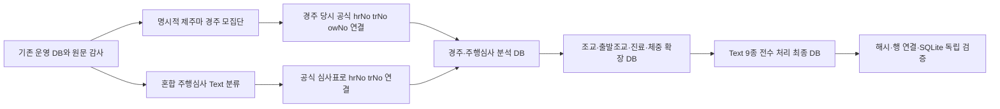

# 제주마 자료 수집·정제·적재 과정 (2026-09-15)

## 1. 문서 목적

이 문서는 2026-09-14~15에 수행한 제주마 전용 연구자료 작업을 처음부터 최종 SQLite까지 한 흐름으로 정리한다. 다른 작업자가 앞선 대화를 보지 않고도 어떤 원천을 사용했고, 어떤 키로 연결했으며, 무엇을 분석 범위에서 제외했는지 재현할 수 있게 하는 것이 목적이다.

최종 산출물은 [`jeju_native_text_phase2.sqlite3`](../data/research/jeju_native_text_phase2_db_20260915/jeju_native_text_phase2.sqlite3)이다. 이 파일은 기존 운영 DB, 원문, 기존 데이터셋, 모델, registry를 수정하지 않고 새 경로에 만든 연구용 스냅샷이다.

| 항목 | 최종 상태 |
| --- | --- |
| 대상 경마장 | 제주 `meet=2` |
| 명시적 제주마 경주 | 2002-07-28~2026-09-12, 9,423경주·92,208출전 |
| 제주마 주행심사 후보 | 2003-07-11~2026-09-09, 1,945심사·15,688출전 |
| 경주·심사 기본 출전 | 107,896행 |
| 경주 분석 뷰 | 90,082출전·407,327구간 |
| 주행심사 분석 뷰 | 11,671출전·46,685구간 |
| 추가 API 자료 | 일별 조교 884,383, 출발조교 184,351, 진료 11,653, 실측 체중 90,713행 |
| Text 문서 | 14,131개 전수 처리 |
| 구조화한 제주 관련 Text 기록 | 876,813행 |
| 명시적으로 제외한 혼합 Text 후보 | 160,397행 |
| 미연결·혼합 후보 원장 | 495,617행 |
| 최종 DB SHA-256 | `0f2871c2a8f931bb968d8bf7086c27f0644c0ef7332b41b7a1bd85ff637c638f` |
| 최종 DB 크기 | 1,535,651,840바이트 |

여기서 “적재 완료”는 확보한 원천에서 제주마로 명확히 확인되었거나 공식 사건과 유일하게 연결된 범위를 뜻한다. 공식 ID가 불명확한 행, 비제주 마종, 제주마 여부가 모호한 혼합 후보, 원천 자체를 확보하지 못한 자료까지 채웠다는 뜻은 아니다.

## 2. 작업 원칙

작업 전 [`JEJU_NATIVE_SOURCE_COLLECTION_AVAILABILITY_2026-09-14.md`](JEJU_NATIVE_SOURCE_COLLECTION_AVAILABILITY_2026-09-14.md)와 [`MODEL_DATA_READINESS_AUDIT_2026-09-14.md`](MODEL_DATA_READINESS_AUDIT_2026-09-14.md)를 읽고 기존 원천과 운영 DB의 범위부터 확인했다. 그 뒤 다음 원칙을 전체 단계에 적용했다.

1. 기존 원문을 우선 재사용하고, 부족한 공식 정보만 한국마사회 공식 API 또는 공식 상세표로 보완했다.
2. 경주 모집단은 `rank` 또는 공식 경주 표기가 **`제`로 명확한 경주**로 제한했다. `한`, `래`는 제외했고, `산`처럼 마종이 확정되지 않는 행은 미확정으로 격리했다.
3. 경주 연결키는 `(meet=2, 경주일, 경주번호, 출주번호)`를 기본으로 하고 `hrNo`와 마명을 교차 확인했다. 주행심사도 같은 구조로 심사일·심사번호·마번을 사용했다.
4. `hrNo`, `trNo`, `owNo`는 모두 앞자리 0을 보존하는 `TEXT`로 저장했다.
5. 이름만으로 ID를 추정하지 않았다. 현재 말 프로필의 조교사·마주를 과거 경주에 소급하지 않았다.
6. 조교·진료 사건은 공식 `hrNo`로 말에게 연결하되, 사건 날짜의 조교사·마주 소속이 별도로 입증되지 않으면 사람 ID를 붙이지 않았다.
7. 충돌, 중복, 누락, 추가행은 임의로 한쪽을 선택하거나 삭제하지 않고 사유 원장에 남겼다.
8. 원천과 중간 산출물을 덮어쓰지 않고 단계별 새 DB를 만들었다.

## 3. 전체 작업 흐름



각 DB는 직전 DB를 복사한 뒤 새 테이블을 추가했다. 이 방식으로 이전 단계의 테이블과 metadata를 보존하면서도 어느 단계에서 어떤 자료가 추가됐는지 구분했다.

| 단계 | DB | 주요 내용 | SHA-256 |
| --- | --- | --- | --- |
| 1 | [`jeju_native_analysis.sqlite3`](../data/research/jeju_native_analysis_db_20260915/jeju_native_analysis.sqlite3) | 경주·주행심사, 공식 신원, 체크포인트, 파생 구간, 사유 원장 | `b7f05ac07f0a08bb1fdfcf4983b06e8b964e8e1a17853f6a9787ae69de35844e` |
| 2 | [`jeju_native_extended.sqlite3`](../data/research/jeju_native_extended_db_20260915/jeju_native_extended.sqlite3) | 1단계 전부 + 일별 조교·출발조교·진료·실측 체중 | `a10cf4ce2d153268926b0bb14a83bbe29a325ba572811b9303f1fa209426da61` |
| 3 | [`jeju_native_text_phase2.sqlite3`](../data/research/jeju_native_text_phase2_db_20260915/jeju_native_text_phase2.sqlite3) | 2단계 전부 + 제주 Text 9종 구조화·격리·coverage | `0f2871c2a8f931bb968d8bf7086c27f0644c0ef7332b41b7a1bd85ff637c638f` |

## 4. 1단계: 경주 모집단 확정과 공식 ID 연결

### 4.1 경주결과 수집

2002~2014년은 기존 [`data/raw/jeju_native_results`](../data/raw/jeju_native_results)를 재사용했다. 이 원천에서 `rank`가 `제`로 시작하는 행만 선택했으며, 2,592경주·24,256행이었다.

2015~2026년은 한국마사회 경주결과 API의 `meet=2` 결과를 사용했다. 혼합 응답에서 명시적 `제` 경주행만 별도 연구 경로에 저장하고 한라마·더러브렛 행은 새 제주마 원문에 저장하지 않았다. 두 시기를 합친 결과가 9,423경주·92,208행이다.

2015~2024년 운영 DB의 제주 출전 55,023행과 공식 결과를 대조했다. 경주장·경주일·경주번호·출주번호·말 ID 기준으로 55,019행이 맞았고, 2019년 4행은 공식 결과와 DB의 말 ID가 충돌했다.

### 4.2 당시 공식 말·조교사·마주 ID

공식 결과 행에 기록된 `hrNo`, `trNo`, `owNo`를 그 경주 당시 ID의 근거로 사용했다. 연결 과정은 [`reconcile_jeju_race_time_ids.py`](../scripts/reconcile_jeju_race_time_ids.py), 후속 확정은 [`materialize_jeju_confirmed_race_ids.py`](../scripts/materialize_jeju_confirmed_race_ids.py)로 재현할 수 있다.

초기 대조에서는 마주 번호 충돌 1,133행이 발견됐다.

- 1,128행은 마주 이름은 같지만 운영 DB의 이름 기반 인물 번호와 경주결과 API의 공식 번호가 달랐다. 사람 전체를 하나의 번호로 합치지 않고, 해당 경주의 공식 결과 번호를 경주별 `owNo`로 채택했다.
- 이름과 번호가 모두 달랐던 5행은 해당 경주의 공식 출전표 API를 추가 대조했다. 공식 결과와 출전표가 같은 `owNo`를 가리켜 그 경주 당시 공식 번호로 연결했다.
- `외부마`, `0BBBBB`처럼 개인 조교사 번호가 아닌 값은 공식 사람 ID로 인정하지 않았다.

후속 원인·근거는 [`JEJU_OWNER_ID_CONFLICT_FOLLOWUP_2026-09-14.md`](JEJU_OWNER_ID_CONFLICT_FOLLOWUP_2026-09-14.md)에, 최종 미해결 29행은 [`JEJU_RACE_TIME_ID_UNRESOLVED_29_2026-09-14.md`](JEJU_RACE_TIME_ID_UNRESOLVED_29_2026-09-14.md)에 기록했다.

정상 결과 90,892행 가운데 공식 세 ID가 모두 연결된 행은 90,863행이다. 미해결 29행은 조교사 공식 번호가 없는 25행과 API/DB 말 ID 충돌 4행이다. 명시적 `제` 경주이지만 경주 전체에 양수 정상 결과가 없는 135경주·1,316행은 원천을 보존하되 일반 결과·구간 분석에서 제외했다.

### 4.3 경계 사례 검사

- 2002-07-28 첫 확인 제주마 경주의 8행과 세 공식 ID를 대조했다.
- 2015년 API/운영 DB 경계에서 임시 `text:` 사람 ID가 경주 당시 공식 ID로 바뀌는지 확인했다.
- 임시 사람 ID가 없는 2025년 722경주·7,071행은 경주·출전 키와 세 ID가 모두 공식 결과와 일치했다.

연도별 연결률, 요청·응답 해시와 행별 원천 위치는 [`data/research/jeju_race_time_official_ids_20260914`](../data/research/jeju_race_time_official_ids_20260914)에 있다. 독립 검증 설명은 [`JEJU_RACE_TIME_OFFICIAL_ID_INDEPENDENT_VERIFICATION_2026-09-14.md`](JEJU_RACE_TIME_OFFICIAL_ID_INDEPENDENT_VERIFICATION_2026-09-14.md)에서 확인할 수 있다.

## 5. 2단계: 제주마 주행심사 연결

기존 제주 `dacom23` Text에는 여러 마종이 섞여 있었다. 총 3,603심사·29,889행을 그대로 제주마로 사용하지 않고 다음과 같이 분류했다.

| 원문 표기 | 행 수 | 처리 |
| --- | ---: | --- |
| `제` 또는 공식 프로필로 제주마 확인 | 15,688 | 제주마 심사 후보로 적재 |
| `한` | 7,338 | 비제주로 제외 |
| `래` | 818 | 비제주로 제외 |
| `검` | 29 | 공식 프로필 대조 후 비제주로 제외 |
| `산` | 6,016 | 제주마임을 확인할 수 없어 미확정으로 제외 |

제주마 후보는 1,945심사·15,688행이다. 공식 주행심사표에 있는 심사일·심사번호·마번·마명·성별·연령을 대조하여 당시 `hrNo`와 `trNo`를 연결했다. 심사표에는 마주 번호가 없으므로 `owNo`는 비워 두었다. 현재 말 프로필의 마주를 넣지 않았다.

공식 `hrNo/trNo` 연결은 15,633행이며, 55행은 마명 34·연령 14·성별 6·공식 대응행 부재 1의 사유로 미해결이다. 2015~2018 Text에서 빠진 구간은 공식 상세표 390건으로 보완하여 2,981출전행에 추가했다. 이 값은 `source_kind='trial_official_web_supplement'`로 원래 Text 구간과 구분했다.

관련 코드는 [`build_jeju_running_trial_links.py`](../scripts/build_jeju_running_trial_links.py), [`confirm_jeju_trial_breed_profiles.py`](../scripts/confirm_jeju_trial_breed_profiles.py), [`audit_jeju_trial_web_sections_2015_2018.py`](../scripts/audit_jeju_trial_web_sections_2015_2018.py), [`validate_jeju_running_trial_links.py`](../scripts/validate_jeju_running_trial_links.py)다. 세부 결과는 [`JEJU_NATIVE_RUNNING_TRIAL_LINKAGE_2026-09-15.md`](JEJU_NATIVE_RUNNING_TRIAL_LINKAGE_2026-09-15.md)에 있다.

## 6. 3단계: 경주·심사 시간 정량화

경주와 주행심사의 초 단위 원시값을 반올림하여 정수 밀리초로 저장했다. S1F와 코너 통과시간은 출발 후 누적시간으로, G3F·G1F는 결승까지 남은 구간의 소요시간으로 해석했다.

```text
G3F 누적시각 = FIN 완주시간 - G3F 원천값
G1F 누적시각 = FIN 완주시간 - G1F 원천값
구간시간 = 다음 체크포인트 누적시각 - 이전 체크포인트 누적시각
구간거리 = 다음 체크포인트 거리 - 이전 체크포인트 거리
```

원천에 없는 중간 시점은 보간하지 않았다. 시간 역전, 비양수 구간, 필수 지점 결측은 `resolution_issue`와 `quarantined_entries`에 남기고 분석 뷰에서 제외했다. 코너 위치가 대략적인 경우 `distance_is_approximate=1`로 표시했다.

파생 구간 454,028행의 거리 분포는 다음과 같다.

| 거리 | 구간 행 수 |
| ---: | ---: |
| 100m | 19,492 |
| 200m | 402,889 |
| 210m | 12,233 |
| 300m | 12,157 |
| 400m | 5,565 |
| 500m | 665 |
| 600m | 1,027 |

따라서 대부분을 웹사이트와 비슷한 약 200m 단위로 분석할 수 있다. 모든 구간이 정확히 측량된 200m는 아니며, 근사 코너 지점 여부를 함께 사용해야 한다. 최종 엄격 분석 범위는 경주 90,082출전·407,327구간, 주행심사 11,671출전·46,685구간이다.

이 단계의 DB 생성과 검증은 [`build_jeju_native_analysis_db.py`](../scripts/build_jeju_native_analysis_db.py), [`verify_jeju_native_analysis_db.py`](../scripts/verify_jeju_native_analysis_db.py)로 수행했다. 전체 테이블 정의와 상태 코드는 [`JEJU_NATIVE_DATA_CATALOG_AND_INDEPENDENT_VERIFICATION_2026-09-15.md`](JEJU_NATIVE_DATA_CATALOG_AND_INDEPENDENT_VERIFICATION_2026-09-15.md)에 정리했다.

## 7. 4단계: 조교·출발조교·진료·체중 확장 적재

경주·심사 분석 DB를 복사해 `jeju_native_extended.sqlite3`를 만들고, 공식 `hrNo`로 확인된 말의 네 가지 자료를 행 단위로 추가했다.

| 자료 | 기간 | 원천행 | 분석 기본 범위 | 주요 처리 |
| --- | --- | ---: | ---: | --- |
| 일별 조교 | 2007-10-01~2026-09-13 | 884,383 | 884,383 | 시간 0도 원천값으로 보존; 양수 시간 866,457 |
| 출발조교 | 2007-10-17~2026-09-13 | 184,351 | 동일 payload 대표 181,198 | 완전 동일 중복 초과 3,153을 원천 보존하고 distinct 뷰 제공 |
| 진료 | 2008-04-02~2026-09-13 | 11,653 | 동일 payload 대표 11,632 | 중복 초과 21 보존; 진단 문자열 있음 10,001 |
| 실측 체중 | 2002-07-28~2026-09-12 | 90,713 | 정상 확정 경주 90,262 | 모두 경주 출전키 연결; 정상 결과키 미보존 630은 별도 원장 |

일별 조교와 출발조교는 기존 혼합 원문을 공식 제주마 `hrNo` 집합으로 분리해 [`data/raw/jeju_native_training`](../data/raw/jeju_native_training)에 보존했다. 수집·분리는 [`materialize_jeju_native_training.py`](../scripts/materialize_jeju_native_training.py)로 수행했다.

진료와 체중은 [`collect_jeju_native_health_weight.py`](../scripts/collect_jeju_native_health_weight.py)로 수집했다. 진료는 2008~2026년 19개 연도 요청, 체중은 2002-01~2026-09의 297개 월 요청이다. 체중 API에서 `rc_year`가 무시되는 현상을 발견해 첫 시도는 격리했고, `rc_month` 기준으로 다시 수집했다. 응답 행의 날짜가 요청 월과 맞지 않으면 실패하도록 검사했다.

이 단계에서 API 네 자료의 모든 행을 `source_row`에 파일 경로, 행번호, 정규화 JSON, 행 SHA-256과 함께 넣었다. 요청 원장은 `collection_request` 316행으로 저장했고 서비스 키는 제거했다. 중복은 `source_duplicate_group`에 남기고 원천행을 삭제하지 않았다.

확장 DB 생성·검증 코드는 [`build_jeju_native_extended_db.py`](../scripts/build_jeju_native_extended_db.py), [`verify_jeju_native_extended_db.py`](../scripts/verify_jeju_native_extended_db.py)다. 자세한 결과는 [`JEJU_NATIVE_EXTENDED_DB_PHASE1_LOAD_2026-09-15.md`](JEJU_NATIVE_EXTENDED_DB_PHASE1_LOAD_2026-09-15.md)에 있다.

## 8. 5단계: Text 9종 전수 처리

확장 DB를 복사해 최종 `jeju_native_text_phase2.sqlite3`를 만들었다. 제주 자료실 Text 14,131문서를 전수 목록화하고 각 문서의 경로와 파일 SHA-256을 `text_document`에 저장했다. 혼합 마종 원문을 통째로 제주마 레코드로 복제하지 않고, 공식 제주 경주·말 사건과 유일하게 연결되거나 원문에 제주산이 명시된 의미행만 구조화했다.

| Text 유형 | 문서 | 후보행 | 구조화한 제주 관련 | 명시 제외 | 미연결·충돌 |
| --- | ---: | ---: | ---: | ---: | ---: |
| `dacom01` 출전표 | 1,094 | 132,535 | 54,219 | 78,316 | 이름 충돌 315 |
| `dacom12` 체중표 | 2,150 | 158,343 | 81,322 | 77,021 | 이름 충돌 4 |
| `dacom13` 주로·말취소·기수변경 | 2,128 | 6,062 | 3,878 | 2,184 | 대응 출전 부재 1 |
| `dacom23` 주행심사 | 1,125 | 별도 모집단 | 후보 15,688 | 비제주·미확정 14,201 | 공식 신원 55 |
| `dacom55` 일별조교 | 3,248 | 894,000 | 520,424 | 구분 불가 | 373,576 |
| `dacom71` 출전마 진료·장구 | 532 | 55,787 | 55,787 | 0 | 이름 충돌 4 |
| `dacom72` 말진료 | 1,150 | 53,185 | 7,362 | 구분 불가 | 45,823 |
| `db4` 출발심사 | 1,005 | 6,683 | 제주산 명시 3,807 | 비제주 산지 2,876 | 공식 말 ID 3,807 |
| `db5` 출발조교 | 1,699 | 222,101 | 150,014 | 구분 불가 | 72,087 |

유형별 연결 규칙은 다음과 같다.

- `dacom01`, `dacom12`, `dacom71`: `(경주일, 경주번호, 출주번호)`와 마명을 공식 출전행과 대조했다.
- `dacom13`: 주로상태는 확인된 제주마 경주가 있는 날짜에만 적용했다. 말취소 724행과 기수변경 1,340행은 공식 출전키로 연결했고, 대응 출전이 없는 기수변경 1행은 격리했다.
- `dacom55`: 날짜·마명·훈련시간·입퇴장시각·기승자 유형이 공식 일별 조교 API와 모두 일치할 때만 연결했다. Text의 `0:21`은 21초가 아니라 21분, 즉 1,260초로 정규화했다.
- `dacom72`: 진료일·마명·마방·진단 문자열이 공식 진료 사건과 일치할 때만 연결했다.
- `db4`: 원문 산지가 `제주`인 3,807행만 구조화했다. 공식 말 ID가 직접 없으므로 이름으로 붙이지 않고 모두 ID 미해결로 유지했다.
- `db5`: 날짜·마명·마방·조번·기승자명이 공식 출발조교 행에서 하나의 공식 `hrNo`로 귀결될 때만 연결했다.

미연결 495,617행에는 실제 제주마가 아닌 혼합 후보가 포함된다. 이 수를 “미연결 제주마”로 해석하지 않는다. 해당 후보의 민감하거나 비제주인 상세 내용을 새 제주마 의미 테이블에 복사하지 않고 문서 ID·행번호·후보 수·사유만 `text_parse_issue`에 남겼다.

최종 Text DB의 생성·검증·카탈로그 코드는 [`build_jeju_native_text_phase2_db.py`](../scripts/build_jeju_native_text_phase2_db.py), [`verify_jeju_native_text_phase2_db.py`](../scripts/verify_jeju_native_text_phase2_db.py), [`export_jeju_native_text_phase2_catalog.py`](../scripts/export_jeju_native_text_phase2_catalog.py)다.

## 9. 최종 DB의 주요 테이블과 사용 방법

| 영역 | 원천 보존·기본 테이블 | 기본 분석 뷰 |
| --- | --- | --- |
| 경주·주행심사 | `event`, `entry`, `section_checkpoint`, `derived_segment` | `analysis_race_segments`, `analysis_trial_segments` |
| 일별 조교 | `daily_training_record` | `analysis_daily_training` |
| 출발조교 | `start_training_record` | `analysis_start_training_distinct` |
| 진료 | `medical_record` | `analysis_medical_distinct` |
| 실측 체중 | `measured_weight_record` | `analysis_measured_weight` |
| Text 구조화 | `text_document`, `text_native_record`, `text_parse_summary` | `analysis_text_race_weight`, `analysis_text_entry_equipment`, `analysis_text_daily_training`, `analysis_text_start_training`, `analysis_text_medical`, `analysis_text_track_snapshot` |
| 근거·검증 | `source_artifact`, `source_request`, `collection_request`, `source_row`, `coverage`, `extended_coverage`, `text_type_coverage` | 해당 없음 |
| 제외·문제 | `resolution_issue`, `extended_issue`, `source_duplicate_group`, `text_parse_issue`, `exclusion_summary` | `quarantined_entries`, `quarantined_text_records` |

출전표, 말취소, 기수변경처럼 별도 분석 뷰가 없는 Text는 `text_native_record.record_type`과 `link_status='official_entry_key_name_linked'`를 조건으로 사용한다. 중복을 포함한 원천 사실을 확인할 때는 기본 테이블을, 일반 분석에서 완전 동일 payload를 한 번만 사용할 때는 `*_distinct` 뷰를 쓴다.

전체 열, SQLite 형식, PK·FK·인덱스와 뷰 SQL은 최종 [`catalog.json`](../data/research/jeju_native_text_phase2_db_20260915/catalog.json)에 있다.

## 10. 원천 추적성과 독립 검증

최종 DB에는 `source_artifact` 14,806건, `source_row` 1,279,932행, 기존 경주·심사 공식 요청 2,624건, 진료·체중 수집 요청 316건이 있다. 요청 원장에는 서비스 키를 저장하지 않았다.

검증은 생성 코드와 별도의 검증 코드로 다음을 확인했다.

1. SQLite `integrity_check`와 외래키 위반 여부
2. 이전 단계 DB의 테이블 행 수와 metadata 보존
3. 원천 artifact 14,806개 실제 파일의 SHA-256
4. 구조화 Text 876,813행의 파일·행번호·줄 SHA-256 전수 대조
5. 경주 출전키·마명·말 ID 연결 전수 대조
6. 일별 조교·출발조교·진료 사건 연결 전수 대조
7. 이름 충돌행에 공식 ID가 잘못 붙지 않았는지 검사
8. `db4`에 원문 산지 `제주`인 행만 들어갔는지 검사
9. 문서별·유형별 coverage와 미확정 상세 미복제 여부

검증 결과는 [`independent_validation.json`](../data/research/jeju_native_text_phase2_db_20260915/independent_validation.json), 요구사항별 완료 판정은 [`completion_audit.json`](../data/research/jeju_native_text_phase2_db_20260915/completion_audit.json)에 있으며 모두 통과했다. 최종 종합 수치는 [`JEJU_NATIVE_COMPLETE_RESEARCH_DB_REPORT_2026-09-15.md`](JEJU_NATIVE_COMPLETE_RESEARCH_DB_REPORT_2026-09-15.md)에서 확인할 수 있다.

프로젝트 루트에서 읽기 전용 검증을 다시 실행하는 명령은 다음과 같다.

```bash
.venv/bin/python scripts/verify_jeju_native_analysis_db.py
.venv/bin/python scripts/verify_jeju_native_extended_db.py
.venv/bin/python scripts/verify_jeju_native_text_phase2_db.py
.venv/bin/python scripts/export_jeju_native_text_phase2_catalog.py
```

새 연구 스냅샷을 다시 만드는 생성 스크립트는 출력 경로가 이미 존재하면 중단하거나 `--force`가 없는 한 기존 산출물을 교체하지 않도록 구성했다. 재생성 전에 각 스크립트의 기본 입력 경로와 출력 경로를 확인해야 한다.

## 11. 현재 공식 연결 범위와 남은 범위

| 구분 | 공식 연결·분석 가능 | 남은 범위 |
| --- | --- | --- |
| 경주 당시 `hrNo/trNo/owNo` | 정상 결과 90,892행 중 90,863행 | 29행: 조교사 번호 없음 25, 말 ID 충돌 4 |
| 주행심사 `hrNo/trNo` | 15,688후보 중 15,633행 | 55행: 마명·연령·성별 충돌 또는 공식행 부재 |
| 출발심사 `db4` | 원문 제주산 3,807행 구조화 | 공식 `hrNo` 3,807행 미연결 |
| 혼합 Text | 공식 사건과 유일하게 연결된 범위만 구조화 | 495,617후보는 제주마 여부 또는 공식 사건을 유일하게 확인하지 못함 |
| 추가 비Text API | 공식 `hrNo`가 있는 조교·출발조교·진료와 출전키 체중 적재 | 원천이 없거나 확인되지 않은 기간·말은 결측으로 유지 |

현재 접근·양성 기록을 확인하지 못한 수영·언덕조교, 예방접종·장제·약물·ECG는 최종 DB 적재 범위가 아니다. 진료 기록 부재를 건강으로, 조교 기록 부재를 훈련 0으로 바꾸지 않는다.

이 작업은 확보한 공식 원천과 보존 Text의 정제·연결·적재 상태를 검증한다. 과거 경주 전 정보의 실제 공개 시각, 모든 기록의 공식 역사적 완전성, 모델 입력 적격성 또는 예측 성능을 검증한 작업은 아니다.

