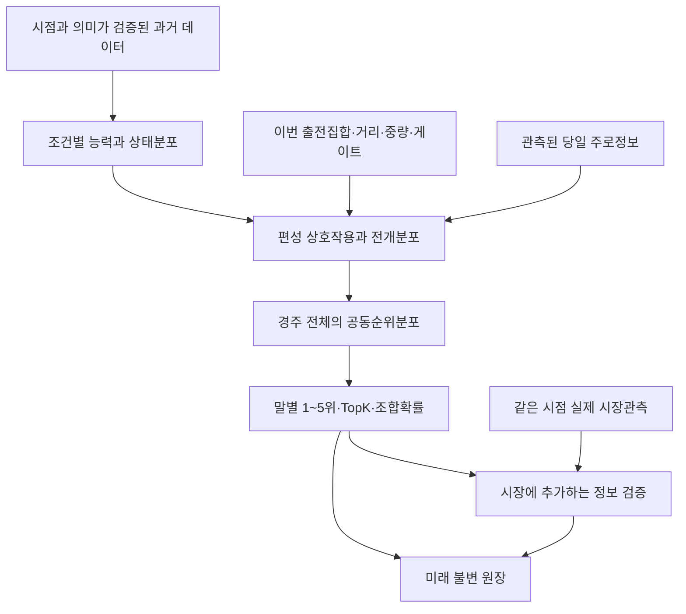

# 한국 경마 예측 연구 방향 재설계

작성: 2026-09-11, Asia/Seoul. 대상: 현재 horse_racing 프로젝트.

**권고: 먼저 구간기록 의미와 사전 출전집합을 바로잡고, 그 위에 ‘말의 조건별 성능분포 × 상대 편성 × 전개분포’를 학습하는 경주 단위 모델을 개발한다.** 가장 단기적인 개선 기회는 데이터·학습 계약에 있고, 가장 큰 장기적인 차별화 후보는 과거 경주에서 가려진 능력을 복원하는 데이터와 모델이다.

이는 새로운 모델의 성능 보고서가 아니라, 실제 코드·DB 감사와 외부 원문에 근거한 연구 제안이다. 예측력 증가율이나 수익은 아직 측정하지 않았다. 기존 모델·DB·데이터셋·미사용 test를 변경하지 않았다. 새로 실행한 결과 조회는 2025-01-01~2026-02-28 학습 기간으로 제한했다. 과거 연구 문서에 이미 공개된 성능과 원장·manifest 메타데이터는 별도로 확인했다.

## 1. 무엇을 확인했는가

인수인계, 문서 색인·진행·현재 상태·운영·원장, 9월 7일 기존 연구 검토, V2/V4/V5·제주 V2·구간 복원·라벨 계약을 검토했다. 실험 원장, 실제 feature 목록, 학습·추론·구간·라벨·배당 코드를 대조하고 SQLite를 읽기 전용으로 조회했다.

- 산출물 감사 재실행: **PASS**, 131 runs / 74 모델 / 34 dataset manifests. 파일 연결 누락 0.
- 주력 V5: `a30cd09a-3b7b-402a-b010-5e7341fd4144`, 177 features, LambdaRank, 단일 softmax beta.
- 제주 V2: `20047697-0b2e-4dac-9a4d-762271f5e1f9`, 최근·장기 75:25 후보 유지.
- 두 run의 등록 `train_period`: `~2026-02-28`, `valid_period`: `2026-03-01~2026-05-31`. 최근 생성한 artifact라는 사실과 최근 결과까지 재학습했다는 사실은 다르다.
- 실제 DB live 원장: **2회 발행, 32경주, 326출전**, 날짜 2026-08-28·09-04. 로컬 분석 파일 전체나 과거 walk-forward 경주수가 prospective 원장 표본수는 아니다.
- 기존 사용자 변경이 다수 존재한다. 이번 작업은 새 보고서와 감사 JSON만 추가했다.

재현 근거: [감사 JSON](../data/logs/research_direction_audit_20260911.json). 실행 SQL, 원장 요약, 코드 SHA-256, 조회 범위를 포함한다.

파일 연결 PASS는 변수 의미·시간 계약·예측력 PASS를 뜻하지 않는다.

## 2. 연구 우선순위를 바꾸는 발견

### A. 구간시간의 물리적 의미가 학습 경로에서 소실된다 — 확인된 문제

[features/base.py](../src/horse_racing/analysis/features/base.py)의 `_SECTIONS_QUERY`는 `elapsed_time_ms`를 읽지만 `time_basis`, `source_kind`를 읽지 않는다. [energy.py](../src/horse_racing/analysis/features/energy.py)는 G3F/G1F 원값을 경주 내 중앙값으로 나누어 ‘종반 상대시간’으로 사용한다.

그런데 서울 DB는 API G1F/G3F를 출발부터 해당 지점까지 **누적시간**, 과거 dacom11은 마지막 구간의 **closing 시간**으로 보존한다. 경주 내 정규화만으로 두 의미가 같아지지는 않는다. 이 차이는 단위 배율 차이가 아니다.

학습 기간 2025-01-01~2026-02-28의 서울 G1F 12,528행, G3F 12,527행이 `cumulative/api4_3`다. 같은 기간 제주·부경은 해당 메타데이터가 NULL인 행이 많아 원천별 확인이 추가로 필요하다. NULL을 임의로 closing으로 해석하면 안 된다.

**실제 사례: 2025-01-04 서울 1경주, race_id=1681, 6번.**

| 항목 | 값 |
|---|---:|
| 전체 주파시간 | 76.6초 |
| 저장 G1F 누적시간 | 63.8초 |
| 마지막 200m 시간 | 76.6−63.8 = **12.8초**, 해당 경주 최단 |
| 현재 원값 기반 상대지수 | **−0.235** |
| closing으로 통일한 상대지수 | **+12.125** |

이는 한 과거 출전의 원시 에너지 관측을 비교한 것으로, 다음 경주의 최종 예측점수나 모델 성능 개선치가 아니다. 현재 값이 선두권 위치 정보로는 유용할 수 있어, 오류를 고쳤다고 적중률이 반드시 높아지는 것도 아니다. 다만 ‘종반 능력’이라는 정의와 계산값이 다름은 확인된다.

**실험:** 누적 통과시간, 마지막 600m, 마지막 200m를 별도 변수로 보존한다. 마지막 600m와 200m는 겹치므로 가능하면 중간 400m도 분리한다. 예를 들어 `last_600 − last_200`으로 중간 400m를 만든다. 역사적 FIN은 그 과거 출전의 보정에만 쓰며, 예측 대상 경주의 FIN은 입력에 들어가지 않는다. 제주 1,110/1,610m S1F=210m 등 거리 계약도 적용한다. 미확정 코너 위치로 속도를 만들어내지 않는다.

서울 복원 문서에는 기존 학습 데이터·모델을 재생성하지 않았다고 명시돼 있다. V5 artifact도 복원 이전에 생성됐다. 기존 이름·feature hash만 맞춰 새 계산을 옛 모델에 투입하지 말고, 새 feature version과 새 dataset으로 재학습·검증한다.

### B. 사후 완주 여부가 학습 출전집합에 영향을 준다 — 확인된 모집단 불일치

[dataset.py](../src/horse_racing/analysis/dataset.py)의 `apply_label_policy`는 특수착순 ≥90을 제외한 다음 `starters`를 다시 계산한다. 따라서 주행중지 말이 사전 경주 편성에서 사라진 것처럼 된다. 같은 문제가 과거 이력의 정상완주 집계에도 있다.

학습 기간에 주행중지(92)는 **54두·46경주** 존재한다. 주행중지는 경주 성립 후 결승에 도달하지 못한 경우를 포함한다. 사전 출전취소와 구별해야 한다. [KRA 출전마 처분제도](https://race.kra.co.kr/raceguide/RaceTakePartHorseCancleService.do?Act=05&Sub=3&meet=2)

이 정책은 ‘정상완주마 사이 순위’ 분석에는 사용 가능하지만, 출발 전 모든 말의 승률 예측과는 목표가 다르다. 주행중지로 실패한 말을 사후 제거하면 두수·상대순위·확률 정규화도 바뀐다. 이런 구조적 누수는 단일 feature AUC 카나리아로 잡기 어렵다.

**실험:** 예측 cutoff 당시 알려진 전체 유효 출전집합을 고정한다. 경주 성립 후 주행중지/실격은 공식 결과에 따른 패배·특수상태로 남기고, 완주시간 회귀에서만 결측/검열로 처리한다. 예측 후 출전취소·환불·경주무효·결과 미확정은 별도 상태로 구분한다. 92를 임의의 ‘92위’ 연속 라벨로 넣으면 안 된다. 동착은 공동우승 사건과 임의 동점해소 순위의 확률을 구분한다.

과거의 cutoff 당시 출전명단이 복구되지 않는 경주는 가정 기반 historical 표본으로 표기하고 진짜 prospective와 섞지 않는다. 기존 정상완주 조건부 지표를 보조로 유지해 변경 영향을 분리한다.

### C. ‘순수 능력’ 목적의 제약이 최종 경주 예측에도 적용된다 — 의도된 계약, 재검토 대상

[model_profiles.py](../src/horse_racing/analysis/model_profiles.py)의 `racefit_v5_sand_event`는 `STRICT_PROXY_FEATURES`를 제외한다. 실제 V5와 제주 V2 계약에도 **부담중량, 부담률, 등급, 공식 레이팅, live_* 당일편향이 없다.**

부담중량은 능력에 따라 배정되는 대리변수인 동시에 이번 경주의 조건이다. 능력만 독립적으로 연구하려고 제거하는 것과, 실제 결과 예측에서 사용하지 않는 것은 다른 결정이다. 출전표는 부담중량·레이팅·등급조건을 제공한다. [KRA 출전표 상세정보](https://www.data.go.kr/dataset/3075638/openapi.do?lang=en)

기존 레이팅 제거 실험은 이미 있었고 일부 개선됐다. 그러므로 전부 되넣으면 좋아진다고 주장하지 않는다. 다음 세 축을 분리한다.

1. 기존 순수 능력 모델은 그대로 기준선으로 유지.
2. **공식 레이팅은 제외한 채** 실제 부담중량·직전 대비 변화·부담률·거리·부담방식만 허용하는 조건 보정.
3. 별도 정보활용 모델에서 cutoff 당시 공식 레이팅까지 허용하는 추가 소거실험.

중량과 성적의 단순 양의 상관을 ‘무거울수록 유리’라는 인과관계로 읽지 않는다. 말의 사전 능력과 배정체계에 조건부로 예측한다. 단조 제약도 물리적 직관만으로 전 구간에 강제하지 않는다.

### D. 당일편향의 연구 성능과 실제 live 입력이 연결되지 않는다

V2 문서의 개선은 당일 앞 경주에 대한 것이다. 하지만 현재 V5 feature 계약에는 그 변수가 없다. 또한 [prediction_frame.py](../src/horse_racing/analysis/prediction_frame.py)는 과거 결과와 sections를 대상 날짜 **이전**으로 제한한다. 기존 live 경로에 당일편향 모델만 끼워 넣으면 연구 시점의 입력을 재현하기 어렵다.

[same_day_bias.py](../src/horse_racing/analysis/features/same_day_bias.py)는 실제 공개시각 대신 `scheduled_at + 20분`을 이용한다. 이것은 보수적 가정이지 실제 관측의 증거가 아니다.

**실험:** 일반 말 이력과 당일 관측 스트림을 분리한다. 원문 최초 관측시각이 cutoff보다 이른 앞 경주만 후자에 허용한다. live와 historical의 동일시점 입력을 대조한다. 첫 경주처럼 정보가 없으면 prior로 수축한다.

당일 ‘선행마가 많이 입상했다’는 비율 대신 **사전에 강하다고 예측했던 정도를 초과해 잘했는지**를 추정한다. 강한 선행마가 몰린 편성을 주로편향으로 오인할 수 있기 때문이다. 예측 이전에 생성한 확률·잔차만 사용한다. 원지표, 편성 보정 잔차, 편향 없는 모델을 비교한다.

### E. 최신 데이터·확률·원장의 이름과 실제 내용은 구별해야 한다

- 두 주요 run의 학습 종료는 등록상 2월 말이다. 최근 말 이력이 feature에 들어가더라도 학습된 계수 자체가 최근까지 갱신된 것은 아니다. 재학습 정책을 별도 실험한다.
- `feature_hash`는 열 이름 목록의 hash다. 값, 계산식, parser 버전, dirty patch까지 동일하다는 보장은 아니다. 데이터 파일 hash·원천 manifest·feature 코드 hash를 추가해야 한다.
- `odds_snapshots`는 **5,593,165행**이지만 `_upsert_final_odds`는 경주×승식×선택키로 확정배당을 갱신한다. 이 행 수를 경주 전 배당 시계열 확보로 해석하면 안 된다. 별도 append-only 관측 테이블과 실제 출발 전 수집 증거가 필요하다.
- 기존 `log_loss`는 출전행 단위 이진 손실이다. 경주당 우승마 NLL과 다르다. ECE는 10개 동일폭 bin이므로 전체 평균이 좋아도 상위 추천·복병 구간이 나쁠 수 있다.
- `horse_static`의 현재 성별을 과거에 적용하는 위험도 코드에 명시돼 있다. 거세 등 변동 가능한 속성은 당시 상태로 버전 관리할 필요가 있다.

## 3. 지향할 모델 구조

‘점수 하나로 모든 착순을 설명’하는 구조를 점진적으로 확장한다. 현재도 경주별 LambdaRank와 상대 feature·전개 실험이 있으므로 경주 개념이 전혀 없다는 진단은 틀리다. 한계는 경쟁 관계와 상태 불확실성을 대부분 사전 요약값과 단일 score로 압축한다는 데 있다.



새 모델이 모든 층을 한 번에 대체할 필요는 없다. 보정된 기존 LightGBM을 기준선과 fallback으로 유지하고, 먼저 보완정보를 전달하는 작은 모델을 추가한다.

## 4. 다양한 방향의 우선순위

아래 ‘가능성’은 연구 판단이며 측정된 개선량이나 성공 확률이 아니다. 비용은 상대적 구현·데이터 확보 부담이다.

| 방향 | 어떤 한계를 바꾸나 | 자료·비용 | 우선순위 |
|---|---|---|---|
| 구간시간 의미 통일 | 잘못된 종반능력 입력 | 보유 원본, 낮음~중간 | **P0** |
| 사전 출전집합·공개시각 복원 | 사후 조건에 맞춘 학습·평가 | 과거 snapshot 부족, 중간 | **P0** |
| 부담조건 별도 모델 | 순수 능력과 당일 결과의 목적 차이 | 보유 출전표, 낮음 | **P1** |
| 시점 일치 재학습·최근화 | 오래된 계수·변화한 모집단 | 보유 데이터, 낮음~중간 | **P1** |
| 보정 구간＋편성 수준 | 같은 4착·같은 막판기록의 의미 차이 | 보유 기록·Elo, 중간 | **P1** |
| 심판 사건의 구조화 | 불리한 주행으로 가려진 능력 | 보유 보고서, 중간 | **P1** |
| 말별 성능 변동폭 | 안정적 입상마와 일발형의 차이 | 보유 결과·착차, 중간 | **P1** |
| 학습형 전개분포＋상대관계 | 평균 페이스 한 가지의 한계 | 정규화 구간, 중간~높음 | **P2 핵심** |
| 최근 경주 시퀀스 | 5경주 평균이 지우는 순서·변화 | 보유 이력, 중간 | **P2** |
| 편성 보정 당일편향 | 능력·편성과 주로효과 혼동 | 실제 관측시각 필요, 중간 | **P2** |
| 시장 잔차·배당경로 | 대중 정보에 추가되는 신호 | 새 시계열 수집 필요 | 수집 **P0**, 모델 **P2** |
| 선택적 영상 trip 분석 | 외곽 주행·막힘·제어 등 비정형 정보 | 영상 접근·라벨링 비용 큼 | 소규모 **P2**, 확대 **P3** |
| 기수·조교사·혈통 계층모형 | 소표본 승률·배정효과·신마 | 일부 원천 추가, 중간 | **P2~P3** |
| TabPFN 등 다른 학습기 | 트리와 다른 오차구조 | 작은 별도 benchmark | **P2 보조** |
| 대형 end-to-end 영상/강화학습 | 전체 자동 시뮬레이션 | 식별·표본·환경 검증 어려움 | **P3 이후** |

### 4.1 가려진 능력: ‘어떤 4착이었나’를 학습한다

같은 4착이라도 강한 상대에게 초반 경합을 겪고 버틴 말, 약한 편성에서 유리하게 달리고 밀린 말은 다른 관측이다. 현재 Elo와 보정 속도지수가 이미 일부를 반영한다. 추가할 것은 단순 변수 개수가 아니라 **과거 성과의 조건부 해석**이다.

과거 경주마다 예상 수준 대비 성능 잔차를 만들고, 거리·주로·상대 수준·초반 부담·사건 정보로 분해한다. 상대의 수준은 그때까지의 이력으로만 추정한다. 과거 상대가 나중에 강해졌다는 정보는 현재 cutoff 전에 확인됐을 때만 갱신 근거로 쓴다. 미래 성적을 과거 능력 추정에 소급하지 않는다.

경주 안에서 빠르기 순위만 정규화하면 전체가 빠르게 달린 경주와 전체가 느린 경주가 비슷해질 수 있다. **경주내 상대값과 경마장×정확거리×당시 주로 기준 절대 구간값을 함께** 보존한다. 단, 기준 par는 훈련 fold 안의 과거로만 만든다.

과거 경주의 방해·전개를 쓰는 것은 다음 경주 예측에서 가능하다. 다음 경주에서 실제로 겪을 방해는 관측값이 아니라 예측분포다. 이 둘을 혼동하면 새 누수가 생긴다.

### 4.2 심판보고서: 모래 사건을 넘어 ‘구조화된 주행사건’ 데이터로

모래 반응의 명시적 사건·최근성이 기존 연구에서 상대적으로 안정적이었다. 이를 바로 모든 사건 가산점으로 확대하지 말고, 다음과 같은 사건 추출 자료를 만든다.

`horse_id, prior_race_id, incident_type, race_phase, affected_horse, initiator, severity_evidence, text_span, extraction_confidence, available_at`

출발 지연, 진로 막힘, 접촉, 기댐, 주행 거부, 외곽 주행, 제어 등이 후보지만 **원문이 뒷받침하는 항목만** 기록한다. 보고서에 없다고 사건이 없었다고 단정하지 않는다. 피해마와 가해마를 구별한다. ‘추진 못함’에서 몇 마신 손실을 임의로 만들어내지 않는다.

LLM은 사건·근거 문구를 추출하는 도구로 사용하고 승률 생성기는 수치 모델로 둔다. 처음에는 무작위 표본과 모델 간 불일치 표본을 함께 골라 사람 검토로 정밀도·재현율을 측정한다. 다음 경주의 결과를 보지 않은 라벨러가 판단하게 한다. 이후 단순 사건 여부→최근성→조건부 성능 보정 순서로 추가한다.

이 방향의 차별점은 ‘다음 경주에 반등할 것’이라는 이야기보다, **재사용 가능한 검증된 사건 데이터셋**에 있다.

### 4.3 전개: 평균 위치에서 학습된 확률분포로

기존 V2의 S1F 점예측과 V4의 게이트 보정이 우승확률에서 일관되게 성공하지 못했다. 기존 [racefit_model.py](../src/horse_racing/analysis/racefit_model.py)의 3시나리오 혼합도 이미 존재한다. 다만 혼합비는 불확실성으로 정해지는 대칭 형태여서 실제 편성으로 학습한 선행전쟁 발생확률과 다르다.

새 시도는 다음 세 변화가 있어야 기존 실패 반복과 구분된다.

1. 정규화된 구간으로 선행경합·초반 상대속도·대열 압축 등 관측 가능한 전개 라벨을 정의한다.
2. 출전마 전체를 보고 전개 상태의 확률과 말별 노출확률을 예측한다. 초반 선두가 누구인지와 몇 두가 동시에 경합하는지의 의존성을 보존한다.
3. 각 전개에서의 결과분포를 혼합하고, 중간 전개 모델의 불확실성을 끝까지 전달한다.

예시 구조는 `P(순위 | 사전정보) = Σ_z P(전개=z | 사전정보) × P(순위 | 전개=z, 사전정보)`다. 처음에는 관측 가능한 2~3개 상태에 한정한다. 무제한 시뮬레이션 상태를 만들어 정교해 보이게 하지 않는다.

중간 모델은 시간순 OOF로 생성한다. 2단계 결과모델이 실제 전개 라벨로만 훈련되고 추론 때 예측 전개를 받게 해서는 안 된다. 전개 MAE 개선만으로 채택하지 않고 최종 winner NLL·공동순위 NLL의 개선을 확인한다.

상대마 상호작용에는 작은 attention/set encoder를 후보로 둘 수 있다. 입력 행 순서를 바꾸어도 해당 말의 출력이 함께 재배열되어야 하며, 게이트는 별도 의미 있는 feature로 남긴다. Set Transformer는 이런 집합 상호작용의 방법론적 근거이지 한국 경마 성능 증거가 아니다. [Lee et al., 2019](https://proceedings.mlr.press/v97/lee19d.html)

영국 경주의 위치 추적 연구는 페이스와 drafting이 결과와 관계있음을 보여주지만, 한국 모래주로에서 같은 계수나 개선폭을 적용할 수는 없다. 구간자료만으로 연속 위치를 정확히 식별할 수도 없다. [Spence et al., 2012](https://pmc.ncbi.nlm.nih.gov/articles/PMC3391435/)

### 4.4 변동성: 우승형과 안정 입상형을 별도로 표현한다

가상 예로 A는 `우승 15%, Top3 75%`, B는 `우승 25%, Top3 40%`일 수 있다. B는 이길 때 강하고 실패할 때 크게 무너지는 말이다. **이 수치는 설명용이며 실제 말에 대한 예측이 아니다.**

단일 worth의 기본 PL에서는 우승확률이 높은 말이 누적 입상확률에서도 높은 순서를 갖는다. 순위 단계 온도만 조정해도 이 표현 제약이 충분히 풀리지 않을 수 있다. 고정 score 조건에서 PL의 순위선택은 남은 상대 사이의 같은 worth 비율을 재사용한다. 기존 경주내 상대 feature가 이런 제약을 일부 완화하지만 조건부 분포 전체를 해결하지는 않는다.

따라서 평균 성능과 **개체별 변동폭**을 함께 예측한다. 단계적으로는 잔차의 분산을 강하게 수축한 분포회귀, 다음에는 전개별 혼합분포를 비교한다. NGBoost 등은 평균 한 점 대신 조건부분포를 학습하는 출발점이다. [Duan et al., 2020](https://proceedings.mlr.press/v119/duan20a.html)

확장 예: `performance_i = mean_i(context) + loading_i × common_pace + individual_noise_i`. 공통 충격이 말별로 다르게 작용해야 순위 의존성을 설명한다. 모든 말에 같은 상수를 더하면 순위는 변하지 않는다. 공분산은 적은 요인으로 제한하고 양의 준정부호 조건을 보장한다.

평균·분산의 식별과 희귀 극단확률을 진단한다. 신마처럼 정보가 없는 불확실성과, 실제로 성적이 널뛰는 변동성은 구분한다. 분산이 크다는 이유만으로 복병 승률을 높여서는 안 된다.

PL 대안의 기록분포·순위모형 연구는 존재하지만 해외 수익 결과는 최종배당·표본에 의존한다. 이 프로젝트에서는 공동순위 NLL과 미래 calibration으로 다시 판정한다. [Lo, Bacon-Shone & Busche, 1995](https://pubsonline.informs.org/doi/abs/10.1287/mnsc.41.6.1048)

### 4.5 이력 시퀀스: 평균이 지워 버린 순서를 복원한다

최근 5경주 평균이 같아도 상승 후 휴양한 말과 하락 후 복귀한 말은 다르다. 경주 간 시간간격, 거리 변화, 조건, 보정 구간, 사건, 조교 변화를 순서대로 입력한다.

가장 싼 기준은 최근 1~5회 개별값＋각 시점 경과일을 기존 GBDT에 제공하는 것이다. 그 다음 작은 GRU/시간 attention을 비교한다. 단순 Kalman 재도입은 V2 실패를 반복할 수 있다. 재도전하려면 관측오차가 사건·출전경력에 따라 달라지거나 휴양 후 상태전환을 다루는 등 실패 원인을 바꿔야 한다.

장기 공통 기록으로 먼저 학습하고 최근 상세자료로 보완하되, pretraining과 feature 정규화에도 미래 fold를 넣지 않는다. 30만 출전행은 독립 30만 사례가 아니다. 같은 말·경주·개최일 의존성을 반영하고 모델 용량을 제한한다.

### 4.6 사람·혈통·경마장: 삭제보다 계층화와 수축

좋은 기수가 좋은 말을 배정받는 효과와 기수의 추가 기여를 단순 승률만으로 분리할 수 없다. 말의 사전 예상성능 대비 기수·조교사 잔차를 시간순으로 추정하고, 말×기수 궁합은 표본이 적으면 평균으로 수축한다. 인과효과라고 단정하지 않는다.

제주 기수 변수를 완전히 없애거나 gain을 줄인 기존 시도가 악화됐으므로 반복하지 않는다. 새 접근의 목적은 분산·배정효과 처리이지 중요도 숫자를 예쁘게 만드는 것이 아니다.

제주는 별도 데이터·마종 계약을 유지한다. 서울·부경은 완전 분리, 완전 통합, 공통층＋경마장별 보정을 동일 조건에서 비교한다. 제주의 원시 속도·등급을 서러브레드와 섞지 않는다. 영천처럼 결과 검증 전인 경마장은 독립적인 cold-start 문제로 두며, 기존 성능을 보장하지 않는다.

혈통은 신마·거리변경마의 사전분포 후보다. 성숙한 경력마에서는 기존 실전기록 대비 추가정보가 작을 수 있다. 혈통 자체와 달리 부·모·형제 성적 집계는 시점 제한이 필요하다. 자료 확보와 소거실험이 선행되어야 한다.

### 4.7 시장: 최고 예측력과 독립 정보가치를 함께 측정한다

배당을 쓰지 않는 능력 연구와 실제 사용 가능한 모든 정보로 하는 예측을 구분한다. T−30, T−5 등을 별도 버전으로 두고, T−5 관측을 T−30 성능으로 부르지 않는다. 기존 T−30 cutoff를 우회하지 않는다.

기본 대조는 같은 경주·같은 시각의 `시장만 / 능력만 / 시장＋능력`이다. G2가 이미 있으므로 단순 혼합을 신기술로 제안하지 않는다. 새로운 자료나 결과분포 모델이 시장에 추가하는지를 묻는다. 추가 시도는 선형 혼합보다 작은 **조건부 잔차 보정**이며, 복잡도를 제한해 시간순 OOF에서 학습한다.

출발 전 배당 이력을 보존하는 수집 작업은 가능한 한 빨리 시작해야 하지만, 이번 조사에서 안정적으로 사용 가능한 KRA 실시간 endpoint를 실증한 것은 아니다. 최종배당 API는 그 대체물이 아니다. 접근 가능한 공식 원천과 제공주기·최초관측을 먼저 확인해야 한다. [KRA 확정배당 안내](https://www.data.go.kr/dataset/15033299/openapi.do?lang=ko)

최종 시장에 지는 결과가 T−30 모델의 유용성 전체를 부정하는 것도 아니고, 시장에 NLL을 추가한다고 공제 후 수익이 생기는 것도 아니다. G2 실패는 해당 모델·기간·결합 방식에서 독립 우위를 입증하지 못했다는 뜻이다.

배팅 연구를 재개할 때는 `E[적중지시자 × 최종배당 | 현재정보]−1`을 목표로 둔다. 결과와 최종배당을 독립이라고 가정한 단순 곱, 단승 배당으로 다른 승식 가격을 대체하는 계산은 별도 근사다. 검증된 정보 우위가 생기기 전에는 Kelly·강화학습 배분이 연구의 주력이 될 이유가 없다.

### 4.8 영상: 큰 차별화 후보이지만 작은 정보가치 검증부터

과거 경주의 외곽 경로, 진로 막힘, 제어, 출발 지연, 가림을 사람이 일관되게 기록하는 소규모 표본을 먼저 만든다. 무작위 경주와 모델 불일치 경주를 섞고 각각 성능을 보고한다. 미래 결과를 본 뒤 ‘불운한 패배’를 골라 라벨링하지 않는다.

사람이 만든 사건 변수부터 기존 표 데이터 위에 추가했을 때 시간순 예측력이 향상되는지 본다. 이 단계에서 정보가치가 없으면 말 식별·카메라 보정·자동 tracking에 큰 비용을 쓰지 않는다. 정보가 확인되면 CV 추출로 자동화하고 인간 라벨 대비 오차가 예측력에 미치는 영향을 측정한다.

정확한 카메라 보정 없이 화면 이동량을 미터·속도·추가 주행거리로 확정하면 안 된다. 패독 영상은 원천 권리·관측시각·일관된 촬영조건을 확보한 후 별도 평가한다. 외형에서 질병이나 회복을 단정하지 않는다.

### 4.9 새 학습기: 시간·탐색 예산을 제한한 도전자

TabPFN은 작은 표 데이터에서 강한 결과를 보고한 연구이므로 제주·최근 표본에 시험할 이유가 있다. 다만 해당 연구의 10,000표본 수준 benchmark를 경마의 시간변화·경주내 의존성·순위문제로 자동 일반화할 수 없다. 모델 버전·사용조건·자원은 실험 시 확인한다. [Hollmann et al., 2025](https://www.nature.com/articles/s41586-024-08328-6)

XGBoost 추가, CatBoost 재비교, 작은 신경망 모두 동일 cutoff·동일 경주에서 제한된 탐색량으로 평가한다. 알고리즘 수보다 서로 다른 정보를 설명하는지와 오차의 보완성이 중요하다. 표 데이터에서 트리 모델은 여전히 강한 기준선으로 유지할 이유가 있다. [Grinsztajn et al., 2022](https://proceedings.neurips.cc/paper_files/paper/2022/hash/0378c7692da36807bdec87ab043cdadc-Abstract-Datasets_and_Benchmarks.html)

## 5. 실제 실험 순서와 중단 기준

### 첫 단계: 데이터의 의미와 기준선을 고정

| 실험 | 바꾸는 것 | 고정하는 것 | 판정 |
|---|---|---|---|
| E0 | 구간 canonical 변환 | 기존 모델 종류·분할·탐색예산 | 원문 대조·단위·거리·시간 검증 후 새 데이터 생성 |
| E1 | 예측시점 출전집합·DNF 처리 | 사전 고정된 경주 집합 | 평가대상·두수 누수 해소; 과거 조건부 성능도 병기 |
| E2 | 중량 조건 보정, 이후 별도 레이팅 | E0/E1 기준·동일 후보군 | race NLL·TopK 소거실험, 경마장별 안정성 |
| E3 | 학습기 직접 winner NLL 목적 | 동일 feature·기간·용량 | LambdaRank→사후 beta와 비교 |
| E4 | 갱신 일정·학습창 | 모델 구조·정보시점 | 고정 과거 모델 vs 사전 고정된 주기 재학습 |

E0/E1은 정확성 계약이다. 이를 고쳐 과거 지표가 나빠져도 잘못된 의미·사후 두수를 되돌려 성능을 ‘복구’하지 않는다. 그 다음 유효한 과거정보를 분리 보존해 신호를 다시 학습한다.

E3의 첫 기준선은 경주별 conditional softmax다. 현재 LambdaRank의 NDCG 목적과 후처리 beta는 winner NLL을 직접 최적화하는 것과 다르다. 모든 말의 확률합=1인 목적을 직접 학습해 순위 목적/확률 목적의 차이를 분리한다. binary loss와 race NLL의 숫자를 섞어 개선율을 계산하지 않는다.

### 두 번째 단계: 새로운 정보·분포를 소규모로 시험

| 실험 | 최소 구현 | 다음 단계로 가는 근거 |
|---|---|---|
| E5 사건·가려진 능력 | 정규화 구간＋근거 있는 심판 사건 | 기존 정보 대비 OOF 증분 개선 |
| E6 변동성 분포 | 수축한 이분산 성능회귀＋기본 PL 대조 | winner·ordered Top3 NLL, TopK calibration 개선 |
| E7 전개분포 | 소수 관측 가능한 전개 상태＋혼합 | 전개 보정뿐 아니라 최종 분포가 개선 |
| E8 이력·편성 encoder | 최근 개별값 GBDT→작은 시퀀스/set 모델 | 단순 기준을 넘는 재현 가능한 추가 정보 |
| E9 영상 정보가치 | 사람 라벨 소규모 pilot | 표 데이터보다 미래 구간에서 추가 개선 |

이 표는 제안이며 실제 실험을 시작한 것이 아니다. 이력상 Kalman·평균 페이스·게이트 직접 투입이 실패했으므로 같은 정의·같은 validation에 새 이름만 붙이지 않는다. 개선 방향을 한 번에 섞지 않고 고정된 기준선과 paired 비교한다.

연구 역량 배분의 초기 제안은 데이터·시간·재현성 40%, 성능분포·전개·사건 35%, 미래 운영·시장 관측 20%, 새 학습기 탐색 5%다. 비용 실측 전의 작업 배분안이지 최적 비율이나 성공확률은 아니다.

## 6. ‘세계 최고’라는 목표를 검증 가능한 조건으로 바꾸기

공통 기간·관측시각·모든 출전마 확률이 공개된 경쟁 벤치마크가 없으면 세계 순위를 객관적으로 증명할 수 없다. 따라서 우선 ‘우리가 접근할 수 있는 강한 기준선과 같은 시점 시장을 미래 데이터에서 지속적으로 이긴다’로 정의한다.

**평가축은 세 개다.** 모든 경주의 확률 정확도, 정해진 후보수에서의 순위 포괄력, 실제 거래조건에서의 수익성. 하나가 좋아졌다고 다른 둘을 통과시키지 않는다.

1. 주 지표: 정상 단독우승 경주의 `race_winner_nll = mean(−log p_winner)`. 동착은 별도 사전 규칙을 정의하고 coverage를 병기한다.
2. 보조: 기존 runner binary LL, Brier, Top1, 우승마 Top3/Top5, 실제 상위3 모두 후보5 포함률.
3. 공동분포: ordered Top3 NLL, rank RPS, 승식별 calibration. 독립 모델의 주변확률합을 맞추는 것만으로 공동분포 정확성을 주장하지 않는다.
4. 세그먼트: 경마장·거리군·경력수·휴양·예측확률 구간·관측정보 결측. 소표본 셀은 수축하며 사후 ‘잘된 구간’만 고르지 않는다.
5. 불확실성: 같은 경주의 예측을 짝지어 차이를 비교하고 개최일/주 단위 block bootstrap을 추가한다. 한 경주의 수백 조합을 독립 표본으로 세지 않는다.
6. 정보가 부족해 관망하는 정책은 경주 선택률과 조건부 정확도를 함께 보고한다. 쉬운 경주 몇 개만 골라 전체 적중률처럼 비교하지 않는다.

제주 179경주의 Top1 32.96%는 59회 적중이다. 단순 독립 Bernoulli 가정의 Wilson 95% 구간도 대략 **26.5~40.1%**다. 이는 후보 선택과 개최일 의존성을 반영하지 않은 참고구간이다. V1 대비 V2의 우승마 Top3 개선 1.68%p는 **3경주 차이**다. 분산이 큰 작은 표본에서 0.x%p 개선을 승격 근거로 삼으면 연구 방향을 잃기 쉽다.

131개의 run은 학습기만 비교한 131개 독립 실험이라는 뜻은 아니지만, 같은 validation을 반복 선택에 사용했다는 탐색 이력은 관리해야 한다. 유한한 검증집합에 대한 모델 선택도 과적합될 수 있다. [Cawley & Talbot, 2010](https://www.jmlr.org/beta/papers/v11/cawley10a.html)

### 미래 검증 계약

- 이번부터 실제로 동결한 시각 이후의 결과만 새 prospective 판정 대상으로 삼는다. 지금 9월이라고 ‘9월 이후 전체’를 미사용으로 선언하지 않는다.
- 제주 V2의 6월 이후 test는 열지 않았다. 다른 연구가 이미 같은 기간 결과로 방향을 선택했다면 모델별 미평가와 연구 전체의 untouched 여부는 다르므로, 새 방법의 최종 판정은 새 미래 표본으로 한다.
- 모델 1개와 challenger 소수의 학습법·변수·갱신주기·보정법·관측시점을 고정한다. 주기 재학습 자체는 사전에 정해진 알고리즘의 일부로 평가 가능하다.
- 학습→조정→확률보정→결합→평가를 시간순으로 분리한다. 상위 모델에 전달하는 하위 모델의 예측은 out-of-time OOF로 만든다. 무작위 K-fold stack은 사용하지 않는다.
- 홀드아웃을 직접 열기 전에는 학습 기간 내부의 연속된 fold와 이미 연구에 사용한 구간으로 개발하되, 후자를 새로운 test라고 부르지 않는다.
- 최소 관심 개선량과 표본수를 사전 과거 손실차 분산으로 계산한다. ‘500경주면 무조건 충분’처럼 고정하지 않는다. 작은 개선에는 더 많은 표본이 필요할 수 있다.
- 다수 challenger를 동시에 판정하면 다중비교를 관리한다. 정해진 평가일 또는 사전 정의한 순차검정으로 승격한다. 매주 승자를 바꾼 뒤 같은 표본을 순수 test로 누적하지 않는다.
- 순위 확률은 하나의 공동분포에서 주변화한다. 연승/복연승 등 예외와 동착·취소는 시행일 규칙을 별도 버전 관리한다. 정책 변경 전 실제 정산 사례로 검증한다.
- 현재 원장의 ‘한 경주 중복 발행 금지’를 유지하면서 여러 challenger·여러 시점을 비교하려면 별도 append-only shadow 원장 설계를 추가해야 한다. 기존 발행 결과를 덮어쓰지 않는다.

예측력 승격은 같은 모집단에서 주 지표 차이의 신뢰구간과 사전 정의한 비열등 보조지표로 판단한다. 수익 승격은 실제 관측배당·가상 마권·총금액·최종정산으로 별도 판정한다. 최고 고배당 적중 제거, 누적 사용액, 최대낙폭 등도 보고하며 적중 사례만 선택하지 않는다.

## 7. 바로 다음 작업의 구체적 산출물

1. **구간 canonical 계약:** 누적·closing·거리·원천별 명세와 원문 대조 사례. 현재 서울 사례를 회귀검증에 사용.
2. **사전 출전집합 계약:** 주행중지·사전취소·사후취소·결측·동착의 학습/확률/정산 처리표.
3. **복원된 기준선:** 새 데이터 버전, parser/feature/data hashes, 기존 V5와 동일 조건 비교. 이전 artifact는 보존.
4. **정보 제약별 모델 대조:** 순수 능력, 능력＋부담조건, 공식 사전정보 포함, 시장 포함을 각각 표기.
5. **연구 실험장부:** 가설, 반증조건, 기존 실패와의 차이, 허용 탐색량, 데이터 시점, 주 지표, 구간, 결과와 기각 이유.
6. **prospective 수집 설계:** 출전표·체중·변경·주로·관측배당·최초공개 원문과 미래 예측을 연결.

진료비·생활비를 경마 수익 기대에 의존시키지 않는 상태에서 연구를 진행해야 한다. 현재 확인된 가장 가치 있는 결과는 수익 가능성 선언이 아니라, 개선 후보를 더 정확하게 시험할 수 있는 구체적인 결함과 차별화 방향을 찾았다는 것이다.

## 부록: 감사 재현

산출물 연결:

```bash
.venv/bin/python scripts/audit_artifacts.py
```

DB 읽기 전용 재조회 예시(감사 JSON에 저장된 제한된 SQL만 실행):

```python
import json
import sqlite3
from pathlib import Path

root = Path('/Users/kimyongjin/Desktop/horse_racing')
audit = json.loads((root / 'data/logs/research_direction_audit_20260911.json').read_text())
connection = sqlite3.connect(f'file:{root}/data/horse_racing.sqlite3?mode=ro', uri=True)
for name, sql in audit['sql'].items():
    print(name, connection.execute(sql).fetchall())
```

이번 작업에서 모델 학습·성능 재평가·미사용 holdout 개방은 하지 않았다. 따라서 새 run ID나 승격 판정은 없으며, 문서의 모든 새 방법은 위 실험을 거쳐야 하는 후보이다.
