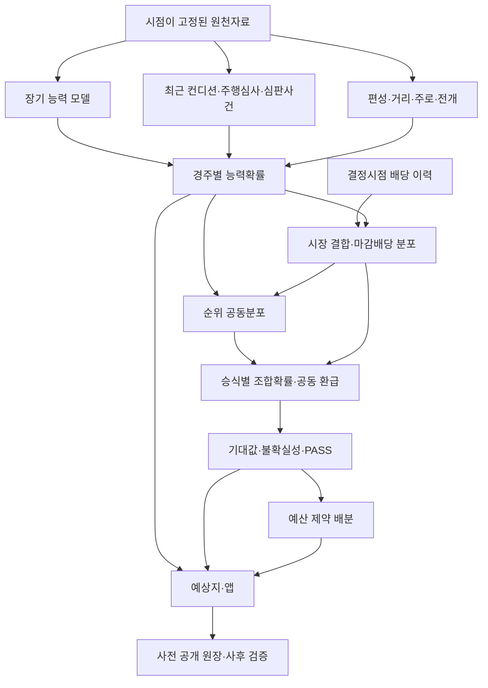

# 한국경마 예상·배팅 모델 연구 총정리

조사 기준: 2026-09-07, Asia/Seoul. 목적: 한국경마 예상지 웹·앱의 모델 연구 의사결정.

**현재 가장 필요한 것은 기존 능력모델을 바탕으로, 승식별 공동확률·배당의 시간 변화·미래 검증을 연결하는 것이다.** 추천 순위의 정확도, 확률의 정확도, 실제 배팅 수익은 각각 다른 문제다. 이 보고서는 대표 학술연구 17건과 공개 프로젝트·자료 8건을 검토하고 우리 프로젝트에 필요한 실험을 제안한다.

이 조사는 접근 가능한 원문·저자 초록·공식 저장소를 중심으로 한 집중 문헌 검토다. 모든 경마 논문을 망라한 체계적 문헌고찰은 아니며, 외부 프로젝트의 성능을 직접 재현하지 않았다. 논문의 보고 결과와 우리 프로젝트에 대한 제안을 구분했다. 기존 모델의 재학습이나 holdout 재평가는 수행하지 않았다.

## 1. 먼저 확인한 우리 프로젝트의 위치

아래 수치는 기존 프로젝트 문서에 기록된 결과다. 서로 다른 기간·모집단의 수치를 한 순위표로 비교하면 안 된다. 문서 사이에 오래된 상태 설명이 남아 있어 세부 실험 문서를 우선했다. 실제 운영 champion은 발행 원장의 run_id로 별도 확인해야 한다.

| 연구선 | 확인된 상태 | 연구적으로 의미하는 것 |
|---|---|---|
| LightGBM+CatBoost 고정 앙상블 | G1 통과, G2 실패 | 단순 최근성적 기준보다 좋지만, 해당 고정 모델이 최종 시장에 독립 정보를 더한다는 증거를 확보하지 못함 |
| G2 시장 비교 | test 이진 LL: 시장 0.270410, 혼합 0.270415; 고정 EV 기준 선택 0건 | 시장 결합 구조와 검증 자체는 이미 존재. 같은 test 재조정으로 실패를 뒤집어서는 안 됨 |
| 순수 능력 V5 | valid Top1 36.3%, 우승마 후보3 포함 65.6% | 배당·레이팅을 제외한 능력 추정 연구 기반. 미사용 미래 검증과 구별 |
| RaceFit V5 Sand Event | 2026년 1,624경주 평가: Top1 33.99%, 우승마 후보3 포함 64.96% | 과거 심판보고서 사건·최근성을 이용하는 연구 기준 모델 |
| Top5 Margin V2 | 669경주 valid: 이진 win LL 0.26976, 우승마 후보5 포함 84.16% | 착차를 보조 회귀로 사용하는 후보. 순위분포 개선과 1순위 적중 개선은 다름 |
| RaceValue V1 | 복병 상위 10% 연승 45경주: 환수율 101.78%, 최고수익 3경주 제외 41.67% | 복병 선별 향상만으로 수익성을 주장할 수 없음 |
| RacePortfolio V1 | 연구 test 367경주 중 안전장치 통과 0경주 | 확률·예상배당·배분 구조는 존재하지만 배팅 가능한 우위는 미입증 |
| 공개 예측 원장 | 발행·정산·hash 검증 및 live 발행 이력 문서 존재 | 사전 예측 검증을 제품에 연결할 기반 |

근거: [PROGRESS](PROGRESS.md), [RaceFit V5](RACEFIT_V5_SAND_RESPONSE.md), [Margin V2](TOP5_MARGIN_V2.md), [RaceValue](RACE_VALUE_V1.md), [RacePortfolio](RACE_PORTFOLIO_V1.md), [예측 원장](PREDICTION_LEDGER.md).

**해석상 주의점 두 가지**

- G2 실패는 해당 모델·표본·결합 방식에서 우위를 입증하지 못했다는 뜻이다. 한국경마의 모든 예측 신호가 시장에 완전히 반영되어 있다는 증명은 아니다.
- 연구 문서 일부의 `ROI 98.33%`는 환수율이다. 순이익률로는 **−1.67%**다. 같은 저장소의 다른 보고서는 순이익률을 ROI라고 표기하므로 지표 이름을 통일해야 한다.

## 2. 문헌을 읽을 때의 네 가지 질문

1. 무엇을 예측하는가: 우승, 입상, 전체 순위, 조합 적중, 최종배당 중 어느 것인가?
2. 언제 알 수 있는 데이터인가: 경주 전 관측값인가, 결과 발표 후 값인가?
3. 무엇을 검증했는가: 무작위 분할, 시간순 분할, 진짜 사전 공개 예측 중 어느 수준인가?
4. 어떤 수익인가: 베팅액 대비 환수율, 순이익률, 복리 자산 증가율 중 어느 것인가?

이 네 가지가 일치하지 않으면 외부 논문의 적중률·ROI를 우리 모델 목표치로 가져오지 않는다.

## 3. 핵심 학술연구 17건

### 3.1 경주 내 확률과 시장 결합

**① Bolton & Chapman, 1986 — Searching for Positive Returns at the Track: A Multinomial Logit Model for Handicapping Horse Races**

Management Science 32(8), 1040–1060. 말·기수·경주 특성을 다항 로짓으로 결합해 경주 내 우승확률을 추정하고 별도 표본에서 단승 전략을 평가했다. 저자 초록상 추정 데이터는 200경주이며, 순위정보를 이용해 추정 효율을 높였다. 현재 기준으로는 작은 표본이다. **우리 적용:** 경주별 확률합이 1인 conditional logit을 설명 가능한 기준선으로 추가하고 기존 GBDT와 동일 기간 비교. 오래된 수익 결과를 한국에 이식하지 않는다. 확인 수준: 출판사 초록·서지. [원문 페이지](https://pubsonline.informs.org/doi/abs/10.1287/mnsc.32.8.1040)

**② William Benter, 1994 — Computer Based Horse Race Handicapping and Wagering Systems: A Report**

능력정보 기반 확률과 대중 배당에서 얻은 확률을 두 번째 로짓 계층에서 결합한다. 결합 학습에 첫 모델의 out-of-sample 예측을 사용해야 한다는 점이 핵심이다. 데이터 관리·확률·시장·자금 배분을 함께 다루지만 공개 보고서가 상업 시스템 전체 재현 명세는 아니다. **우리 적용:** 이미 구현된 G2 결합 구조를 유지하면서, 새 모델과 실제 관측 시점 시장을 대상으로 시간순 OOF 결합을 검증한다. 1993년 발표 기록과 1994년 보고서를 구별한다. 확인 수준: 보고서 PDF. [보고서](https://gwern.net/doc/statistics/decision/1994-benter.pdf)

**③ Lessmann, Sung & Johnson, 2011 — Towards a Methodology for Measuring the True Degree of Efficiency in a Speculative Market**

Journal of the Operational Research Society 62, 2120–2132. 홍콩경마를 대상으로 예측 당시 사용할 수 없는 정보, 점추정에 의존한 평가, 최근 정보로 모델을 갱신하지 않는 평가가 시장효율성 판단을 왜곡할 수 있음을 논의한다. **우리 적용:** 데이터가 존재하는 날짜와 실제 공개된 시각을 분리하고, 배당·모델 갱신 정책을 포함한 평가 절차를 먼저 동결한다. 확인 수준: 저자 소속기관 초록; 전문 접근 제한. [기관 저장소](https://eprints.soton.ac.uk/167713/)

**④ Lessmann, Sung, Johnson & Ma, 2012 — A New Methodology for Generating and Combining Statistical Forecasting Models to Enhance Competitive Event Prediction**

European Journal of Operational Research 218(1), 163–174. 경쟁자 사이 관계를 반영하는 conditional-logit stacking과 예측 결합을 연구한다. **우리 적용:** LightGBM·CatBoost를 많이 늘리는 것보다 장기 능력·최근 상세정보·시장·전개처럼 다른 정보를 쓰는 모델의 보완성을 평가한다. 결합계수는 시간순 OOF에서만 학습한다. 확인 수준: 출판사 초록; 세부 수익률 재현 미확인. [출판사](https://www.sciencedirect.com/science/article/pii/S0377221711009714)

### 3.2 우승확률을 복합 승식으로 확장

**⑤ David Harville, 1973 — Assigning Probabilities to the Outcomes of Multi-Entry Competitions**

JASA 68(342), 312–316. 우승확률로 순서확률을 계산하는 가정을 제시하고 335경주 자료에 적용했다. **우리 적용:** 현재 Plackett–Luce(PL) 조합 계산의 기준이 되는 연구다. 계산이 간단하다는 장점과 2·3위까지 동일한 능력구조를 재사용한다는 제약을 구별해야 한다. 확인 수준: 출판사 초록. [출판사](https://www.tandfonline.com/doi/abs/10.1080/01621459.1973.10482425)

**⑥ Lo, Bacon-Shone & Busche, 1995 — The Application of Ranking Probability Models to Racetrack Betting**

Management Science 41(6), 1048–1059. 지수분포를 가정하는 기존 방식과 다른 기록분포·순위확률 근사를 비교한다. 미국·홍콩에서 개선을 보고했으나 일본에서는 수익 차이가 작았고, 최종배당 사용·계산비용 0 가정이 명시된다. **우리 적용:** PL이 잘 맞지 않는 조합 구간을 찾아 rank-damped 모형이나 기록분포 시뮬레이션을 challenger로 비교한다. 국가별 결과 차이는 한국 재검증의 필요성을 보여준다. 확인 수준: 출판사 초록. [출판사](https://pubsonline.informs.org/doi/pdf/10.1287/mnsc.41.6.1048)

**⑦ Michael Pearce, 2026 — Efficient Bayesian Inference for Benter Models on Ranked Data**

2026-08-24 arXiv 사전공개. 순위 단계별 감쇠계수를 갖는 Benter 순위모형의 Bayesian 추정을 제안한다. 예시는 선호조사·선거 순위이며 경마 수익 실증은 아니다. **우리 적용:** 1위보다 2·3위 선택이 더 불확실한 구조를 확률모형에 표현하는 참고 자료. 초기에는 소수 감쇠계수의 최대우도 추정으로 가치를 확인하고 Bayesian 계산은 그다음이다. Benter의 ‘시장 결합’과 ‘순위 감쇠’는 서로 다른 구성요소다. 확인 수준: 저자 초록; 미심사 사전공개. [arXiv](https://arxiv.org/abs/2608.23825)

### 3.3 국내 직접 유사 연구

**⑧ 최혜민·황나영·황찬경·송종우, 2015 — 서울 경마 경기 우승마 예측 모형 연구**

응용통계연구 28(6), 1133–1146. KRA 말·기수·조교사 자료로 순위와 기록 기반 선형회귀·로지스틱·랜덤포레스트를 비교했다. 최근 한 달 별도 자료에서 단승·복승·삼복승의 양의 수익을 보고한다. **우리 적용:** 순위와 기록의 보조학습을 함께 살펴볼 국내 선행연구. 한 달 결과만으로 장기 수익을 입증하지 못하며 당시 관측 가능 시각·정산·표본 선택은 전문 재검증이 필요하다. 확인 수준: KCI 저자 초록·서지, 전문 미확보. [KCI](https://www.kci.go.kr/kciportal/ci/sereArticleSearch/ciSereArtiView.kci?sereArticleSearchBean.artiId=ART002068008)

**⑨ Yubin So·Eunbi Woo·Hanjun Lee, 2025 — Machine Learning-based Learning-to-Rank Approach for Horse Race Prediction and Web Service Development**

한국컴퓨터정보학회논문지 30(11), 311–318. 서울 2024-05~2025-04 자료의 9,140관측치를 사용하고, 평가에는 191경주를 기술한다. CatBoost NDCG 0.8895를 보고하며 웹 예상 시스템까지 구현했다. **우리 적용:** 제품 목표와 매우 유사하나 NDCG는 적중률 88.95%가 아니다. 경주별 5-fold는 시간순 미래검증을 보장하지 않는다. 표 2의 실제 목적함수는 LightGBM `rank_xendcg`, XGBoost `rank:pairwise`, CatBoost `YetiRankPairwise`로, 본문 LambdaRank 명칭과 구별해야 한다. 9,140행과 191경주의 연결·누적정보 생성시점은 재현 전 확인 대상이다. 확인 수준: 전문 8쪽. [논문 PDF](https://journal.kci.go.kr/jksci/archive/articlePdf?artiId=ART003266151)

### 3.4 시장의 편향과 배당 경로

**⑩ Snowberg & Wolfers, 2010 — Explaining the Favorite-Longshot Bias: Is It Risk-Love or Misperceptions?**

Journal of Political Economy 118(4), 723–746 / NBER WP15923. 장기 고배당마 과대평가 현상을 단승과 복합 승식 자료로 분석하며 확률 오인 설명을 지지한다. **우리 적용:** 인기순위·배당구간별 calibration 및 순이익률 곡선을 만든다. ‘배당이 높다’와 ‘저평가됐다’를 구분한다. 한국에서도 같은 방향과 크기라고 가정하지 않는다. 확인 수준: 저자 초록·working paper. [NBER](https://www.nber.org/papers/w15923)

**⑪ Hanyu, Ishii, Otani & Teramoto, 2025/2026 — Are Final Market Prices Sufficient for Information Aggregation? Evidence from Last-Minute Dynamics in Parimutuel Betting**

arXiv v3 등록 2026-08-20. 일본 JRA 2004–2023 중간배당 자료를 이용해 비슷한 최종배당에서도 마감 직전 배당 하락 경로와 실현 수익이 연관됨을 보고한다. **우리 적용:** T−30·10·5·1분처럼 관측 시각을 고정한 배당 이력, 변화율, 마감배당 예측을 별도 연구한다. 마감까지의 변화 자체는 의사결정 당시 미지수일 수 있으므로 그대로 feature로 쓰지 않는다. 저자 결과는 한국의 실행 가능한 수익전략 증명이 아니다. 확인 수준: v3 전문·초록, 사전공개. [v3 전문](https://arxiv.org/html/2509.14645v3)

### 3.5 확률 보정과 자금 배분

**⑫ Guo et al., 2017 — On Calibration of Modern Neural Networks**

ICML/PMLR 70, 1321–1330. 정확도가 좋아도 확신도가 부정확할 수 있으며 temperature scaling을 평가한다. 경마 논문은 아니다. **우리 적용:** race softmax의 온도 보정을 후보로 비교하고, 순위 점수를 바로 확률로 읽지 않는다. 신경망 실험의 우수성이 GBDT 경마에도 그대로 성립한다고 가정하지 않는다. [논문](https://proceedings.mlr.press/v70/guo17a.html)

**⑬ Kull, Silva Filho & Flach, 2017 — Beta Calibration: A Well-founded and Easily Implemented Improvement on Logistic Calibration for Binary Classifiers**

AISTATS/PMLR 54, 623–631. 이진 확률을 beta calibration으로 보정한다. 소표본 isotonic의 과적합과 logistic 보정의 제약을 설명한다. **우리 적용:** 현재 승식별 beta calibration의 비교 기준. 모든 조합을 개별 보정하면 경주 전체 공동분포가 일관되는지는 별개로 검증해야 한다. [논문](https://proceedings.mlr.press/v54/kull17a)

**⑭ Busseti, Ryu & Boyd, 2016 — Risk-Constrained Kelly Gambling**

Journal of Investing 25(3), 118–134. 로그자산 성장과 자산 하락 위험 제약을 함께 최적화하며 코드·예제를 공개했다. **우리 적용:** 승식 간 중복 적중을 반영한 시나리오별 환급행렬과 현금 보유를 사용해 배분한다. 이론의 위험 보장은 모형 가정하의 결과이며 잘못 추정한 확률까지 보장하지 않는다. [저자 페이지](https://stanford.edu/~boyd/papers/kelly.html)

**⑮ Sun & Boyd, 2018 — Distributional Robust Kelly Gambling: Optimal Strategy under Uncertainty in the Long-Run**

확률분포를 하나로 확정하지 않고 가능한 분포 집합에 대해 보수적 성장을 최적화한다. **우리 적용:** 희귀 조합과 마감배당 오차를 반영한 robust EV·배분 challenger. 신뢰구간 하한 확률과 q20 배당을 곱하는 휴리스틱이 정식 robust 최적화와 같다고 보지 않는다. 확인 수준: 저자 초록, arXiv. [논문](https://arxiv.org/abs/1812.10371)

**⑯ Bailey, Borwein, López de Prado & Zhu — The Probability of Backtest Overfitting**

많은 후보 중 좋은 백테스트를 선택하는 과정의 과적합을 다룬다. 확인 자료는 저자 공개 manuscript이며 초기 원고·후속 출판 연도는 구별해야 한다. **우리 적용:** 이미 반복 분석한 2026년은 새 모델에 대해서도 완전히 독립적인 증거가 아니다. 후보·실패·전략 탐색 수를 남기고 새 미래 원장을 사용한다. CSCV를 적용하더라도 시간순 검증을 대체하는 것으로 쓰지 않는다. [저자 원고](https://www.davidhbailey.com/dhbpapers/backtest-prob.pdf)

### 3.6 장기 확장 방향

**⑰ Pierre Colle, 2022 — What AI Can Do for Horse-racing?**

영상인식·통계학습·게임이론을 연결하는 전망성 논문이다. **우리 적용:** 장기적으로 영상에서 주행 위치·주행거리·접촉·모래 노출을 추출하는 방향의 참고 자료. 당장 영상 모델이나 강화학습을 도입하면 수익이 난다는 실증 근거로 쓰지 않는다. 현재는 이미 보유한 구간기록·심판보고서의 정보가치를 먼저 확인하는 편이 현실적이다. 확인 수준: 저자 초록, arXiv. [논문](https://arxiv.org/abs/2207.04981)

## 4. 공개 프로젝트·자료 8건과 가져올 부분

아래 성능은 모두 작성자 보고다. 코드 존재, 코드 실행 가능성, 실전 수익 검증은 서로 다른 수준이다. 코드·데이터 재사용 전 LICENSE와 데이터 사용조건은 별개로 확인한다.

| 프로젝트 | 공개 내용·증거 | 가져올 부분 | 한계·한국 적용 판단 |
|---|---|---|---|
| [PeterLiuLiuLiu/Horse-Racing-Prediction-HKJC](https://github.com/PeterLiuLiuLiu/Horse-Racing-Prediction-HKJC) | Benter 재현을 목표로 수집·학습·확률 계산 코드 공개 | 능력·시장 계층의 작은 예제 | README에 오래된 수집 접근 문제 기록. 현재 동작·장기 수익 확인 안 됨 |
| [catowabisabi/horse-racing-model-training](https://github.com/catowabisabi/horse-racing-model-training) | 코드·처리자료·리포트. 복승 2017 +7.9%, 2018 H1 452건 +2.6% 순이익률 보고 | 무배당 모델, 승식별 기준선, OOS 비교 | 2018에는 재학습. 표본·선택 편향·확정배당 필터를 확인해야 함. 중간배당 수익표는 해당 가격으로 정산했는지 우선 감사 |
| [justinsuo/hkjc-edge-lab](https://github.com/justinsuo/hkjc-edge-lab) | conditional logit·시장 결합·walk-forward·NO-GO 화면. OOS 356경주 우위 미입증 보고 | 실패 판정도 공개하는 UX, placebo, 미래 데이터 추가 불변성 검사 | README의 closing-line 용어를 그대로 채택하지 말고 시장 대비 NLL 개선으로 정확히 명명 |
| [Tang6133/hkhorseracing-predictor](https://github.com/Tang6133/hkhorseracing-predictor) | 시스템 설명·예측 CSV 원장. 소스·학습모델·feature pipeline은 비공개라고 명시 | 확률·후보군·주로 태그·검증 화면의 제품 구분 | 오픈소스 학습 엔진이 아님. 작성자가 시장 비교 열위와 음의 수익도 보고. 임의 확률 cap은 복제하지 않음 |
| [dominicplouffe/HorseRacingPrediction](https://github.com/dominicplouffe/HorseRacingPrediction) | 북미 harness racing SVR 예제와 train/validation 자료 | 작은 기준 모델의 데이터 흐름 이해 | 마차경주, 거리·출발 방식 차이, Python 2.7 기반. 한국 모델의 핵심 기반으로 부적합 |
| [dickreuter/betfair-horse-racing](https://github.com/dickreuter/betfair-horse-racing) | 가격정보 신경망, 수집·추천·주문·Flask 화면 | 운영 로그·시장자료와 모델 분리 | 거래소 back/lay·수수료 구조. 한국 총매출 배분 방식과 정산 구조가 달라 배팅 엔진을 이식하면 안 됨 |
| [eprochasson/horserace_data](https://github.com/eprochasson/horserace_data) | HKJC·Singapore Turfclub 데이터 저장소 | 해외 별도 검증용 데이터 구조, 결과·배당·시계열 키 검사 | 한국과 학습 표본을 바로 합치지 않음. 보유기간·결측·타임스탬프·사용권 검증 필요 |
| [cvxgrp/kelly_code](https://github.com/cvxgrp/kelly_code) | risk-constrained Kelly 저자 코드·예제 | 수학적 배분 검증의 출발점 | 경마 전체 시스템은 아님. 우리의 순위·배당 시나리오와 정수 단위 제약이 추가로 필요 |

**가장 유용한 조합:** 제품 표현은 Tang의 공개 원장, 검증 운영은 Edge Lab, 확률 결합은 Benter, 배분 수학은 Boyd 계열을 참고한다. 외부 저장소의 고수익 숫자는 별도 재현 전 연구 가설로만 취급한다.

## 5. 우리가 만들 모델의 구조



위 구조는 **이 보고서의 설계 제안**이다. 모든 계층이 현재 운영에 연결되어 있다는 뜻은 아니다.

### 5.1 예상 모델: 오늘의 편성에서 얼마나 강한가

| 정보 축 | 후보 feature | 현재 기반과 추가 연구 |
|---|---|---|
| 장기 능력 | 경기장×정확거리×주로 보정 속도, 상대 편성강도, Elo | 이미 존재. 원시 기록·등급을 시대 간 직접 비교하지 않기 |
| 최근 상태 | 최근 1·3·5경주 추세, 휴양기간, 체중 편차, 부진 이후 회복 | 평균만 쓰지 않고 추세·분산·관측수 함께 제공 |
| 거리·주로 적성 | 거리 변화, 함수율, 초반/종반 에너지, 부담중량 변화 | 기록과 조건의 상호작용 검증. 희소 조건은 상위 집단으로 수축 |
| 편성과 전개 | 선행 후보 수, 예상 초반 위치, 게이트×초반속도, 예상 페이스 | 실제 대상 경주의 S1F는 금지. 전개 예측 자체도 OOF 생성 |
| 사람 효과 | 기수·조교사 최근 성적, 말-기수 조합, 교체 | 표본 작은 조합 승률을 평균으로 수축. 최신 통산성적 과거 JOIN 금지 |
| 신마·휴양마 | 주행심사 기록, 심사와 경주 간 기간, 혈통의 거리 정보 | 기존 경력마와 결측 의미가 다름. 별도 평가와 불확실성 확대 |
| 사건 정보 | 출발불량·접촉·모래반응·주행거부·교정 이후 경과 | V5 사건 모델 확장 후보. 사건 후 모든 말을 동일 보너스로 처리하지 않음 |
| 당일 편향 | 이미 끝나고 결과가 공개된 앞 경주의 잔차 | 후속 경주 결과가 섞이지 않는 순차 업데이트 |

원천 가용성 참고: [KRA 확정배당 API](https://www.data.go.kr/data/15058559/openapi.do), [일별 훈련 자료 안내](https://www.data.go.kr/dataset/3075647/openapi.do), 로컬 [데이터 카탈로그](DATA_SOURCE_CATALOG.md). API가 있다고 그 값의 경주 전 공개시각까지 검증된 것은 아니다.

**모델 후보 순서 제안:** 기존 V5 유지 → conditional logit 기준선 → 장기/최근 모델의 시간순 OOF 결합 → 순위별 감쇠 → 전개·기록분포 모형. 대형 신경망은 이러한 기준선 대비 독립 개선을 입증할 데이터가 쌓인 뒤 비교한다.

과거 기록을 학습 target으로 사용해 능력을 추정하는 것과 대상 경주의 실제 기록을 feature에 사용하는 것은 다르다. 전자는 가능한 설계, 후자는 누수다. 현재 Margin V2의 보조 회귀 방향은 이 구분과 맞는다.

### 5.2 시장 모델: 능력 확률에 가격 정보를 어떻게 더할까

단승의 원금 포함 배당을 `D_i(t)`라 하면 기초 시장확률은 다음처럼 정규화할 수 있다.

```text
q_i(t) = [1 / D_i(t)] / Σ_j [1 / D_j(t)]
p_i(t) = softmax_i { α log(p_ability_i) + β log(q_i(t)) }
```

이것은 [Benter 보고서](https://gwern.net/doc/statistics/decision/1994-benter.pdf)를 참고한 기본형이다. α·β의 이름은 기존 G2 코드와 다를 수 있으므로 계수의 의미로 비교한다. `q`는 진짜 확률의 관측값이 아니라 기준 추정치다. 결합 가중치는 고정 비율을 임의로 정하지 말고 앞선 기간의 OOF 예측으로 추정한다.

다음 세 비교를 동시에 수행한다.

- 능력만 vs 해당 시점 시장만 vs 해당 시점 시장+능력.
- 현재배당 수준만 vs 관측된 배당 변화 경로 추가.
- 사전 모델 vs 최종시장: 사후 정보량 참고 비교이며 구매 가능 가격 비교로 부르지 않음.

배당 모델은 `log(D_final / D_t)` 또는 최종 pool share의 조건부분포를 예측하도록 설계할 수 있다. 초기에는 분위수 회귀와 현 배당 유지 기준선을 비교한다. 승식별로 다른 pool이므로 단승 인기만으로 삼복승 가격을 정확히 안다고 가정하지 않는다. 이는 일본 배당 경로 연구를 한국에서 검증하기 위한 제안이다. [Hanyu et al.](https://arxiv.org/html/2509.14645v3)

### 5.3 순위 공동확률: 상위 3두 개별 확률만으로 부족하다

동착·취소가 없는 기본 PL 모형에서 정규화된 우승확률을 `p_i`라 하면:

```text
P(i 1위, j 2위) = p_i × p_j / (1 − p_i)
P(i 1위, j 2위, k 3위)
    = p_i × p_j / (1 − p_i) × p_k / (1 − p_i − p_j)
```

근거가 되는 순위 모형은 [Harville](https://www.tandfonline.com/doi/abs/10.1080/01621459.1973.10482425)과 [Lo et al.](https://pubsonline.informs.org/doi/pdf/10.1287/mnsc.41.6.1048)이다. 다음 승식 변환은 그 공동분포를 이용하는 설계다. 공식 승식 의미는 [KRA 자료 안내](https://www.data.go.kr/dataset/15033299/openapi.do?lang=ko)를 참고한다.

| 승식 | 필요한 확률 |
|---|---|
| 단승 WIN | `P(i 1위)` |
| 연승 PLC | 해당 경주의 입상 조건에 따른 `P(i Top2)` 또는 `P(i Top3)` |
| 복승 QNL | `P(i,j)` + `P(j,i)` |
| 쌍승 EXA | 순서가 지정된 `P(i,j)` |
| 복연승 QPL | 두 말이 모두 Top3에 포함되는 모든 허용 순서·제3마의 확률 합 |
| 삼복승 TLA | 지정 3두의 6개 순서확률 합 |
| 삼쌍승 TRI | 지정 3두의 한 순서확률 |

**코드·설계 확인 과제:** 현재 [RacePortfolio 문서](RACE_PORTFOLIO_V1.md)의 생성 승식 목록에는 복승과 삼쌍승이 없다. 전체 승식 지원을 표방하기 전에 생성·정산·확률검증 지원 여부를 확인해야 한다. 또한 삼복승/삼쌍승 약어는 공급자별로 다를 수 있으므로 내부 이름을 명시적으로 저장한다.

일관성 조건은 동착·취소 없는 일반 경주에서 다음과 같다.

- 말별 우승확률 합은 1, 정확한 각 순위확률 합은 1.
- 말별 누적 TopK는 단조 증가하며, 경주 내 TopK 확률의 합은 K.
- 서로 배타적인 모든 순서 top3 조합확률 합은 1.
- 단승·연승·복연승·삼복승의 중복 적중은 같은 순위 시나리오에서 계산.
- 동착·취소·경주무효는 별도 결과 상태와 실제 정산규칙으로 처리.

말별 확률합을 맞추는 것만으로 공동분포가 정확해지지는 않는다. 특히 승식별 개별 beta calibration 이후 서로 다른 승식이 하나의 일관된 공동분포에서 나온 값인지 확인해야 한다. 이는 현재 코드의 확정 버그 판정이 아니라, 배분 모델 승격 전 필요한 검증 항목이다.

### 5.4 PL 이후 가장 먼저 할 실험

순위 단계 `k`별로 남은 말의 선택 가중치를 `worth_i ** gamma_k`로 둔다. 첫 단계는 기준을 고정하고 이후 단계만 추정해 식별성을 확보한다. 예를 들어 `gamma_2`, `gamma_3`가 1보다 작으면 하위 순위 선택을 더 평평하게 만들 수 있다.

**실험 조건 제안:** 기존 V5 점수는 고정하고 PL과 감쇠 PL의 순서 top3 NLL·조합별 calibration만 비교한다. 이후 별도 실험으로 전개 시나리오별 PL 혼합, 정규/로그정규 기록분포 기반 Monte Carlo를 비교한다. 순위확률 변화와 능력 feature 변화를 한꺼번에 섞지 않아야 원인을 알 수 있다. 단계별 감쇠의 참고는 [Pearce](https://arxiv.org/abs/2608.23825), 다른 기록분포의 참고는 [Lo et al.](https://pubsonline.informs.org/doi/pdf/10.1287/mnsc.41.6.1048)이다.

## 6. 배팅 모델에서 반드시 분리할 수학

### 6.1 적중률과 기대수익

원금 포함 정산배당 `D`가 확정된 단순 예에서 단위 베팅 기대순익은 `p×D−1`이다.

| 가상 예 | 적중확률 | 정산배당 | 단위 기대순익 |
|---|---:|---:|---:|
| A | 40% | 2.0배 | −20% |
| B | 25% | 5.0배 | +25% |

위 숫자는 설명용 가상 예다. B의 확률과 배당이 정확해야만 계산된 우위가 의미 있다.

총매출 배분 방식에서는 결정시점의 화면배당을 고정된 계약가격처럼 정산하면 안 된다. 의사결정은 그때까지의 정보로 하고 실제 손익은 공식 확정배당으로 정산한다. 배당에 이미 반영된 공제율을 한 번 더 차감하지 않는다. 개인별 적용 공제·세금·반올림 등은 정산 규칙에서 별도로 버전 관리한다. 일반적 시장 구조는 [Hanyu et al.](https://arxiv.org/html/2509.14645v3), 공식 결과자료는 [KRA 확정배당 API](https://www.data.go.kr/data/15058559/openapi.do) 참조.

### 6.2 최종배당은 확률변수다

결정시점 정보집합을 `I_t`, 조합 적중 여부를 `W_c`라 하면 더 정확한 목표는 다음이다.

```text
EV_c(t) = E[1{W_c} × D_final,c | I_t] − 1
        = P(W_c | I_t) × E[D_final,c | W_c, I_t] − 1
```

따라서 `P(적중) × E[최종배당 | 현재정보]`는 조건부 독립 또는 근사 가정이 필요하다. 뒤늦게 들어오는 정보가 적중확률과 배당을 동시에 바꿀 수 있기 때문이다. 특히 연승·복연승 환급은 다른 입상 조합에 따라서도 달라질 수 있으므로 가능한 한 결과·배당을 함께 시뮬레이션한다.

현재 q20 배당 선택 규칙은 보수적 휴리스틱이다. **q20은 95% 신뢰하한이 아니며, q20 가격에서 양의 값이라고 실제 수익확률 80%가 되는 것도 아니다.** 분위수 커버리지와 선택된 조합에서의 예측편향을 따로 검사해야 한다. 분포 불확실성을 반영하는 정식 방향은 [Sun & Boyd](https://arxiv.org/abs/1812.10371)를 참고한다.

### 6.3 Kelly는 우위를 만들어주지 않는다

하나의 이진 베팅, 정확한 확률 `p`, 확정 원금포함 배당 `D>1`이라는 제한된 경우:

```text
f* = max(0, (p×D − 1) / (D − 1))
```

여러 승식이 겹치는 경우 개별 Kelly 금액을 그냥 합하지 않는다. 결과 시나리오 `s`의 자산은:

```text
B_after(s) = B_before − Σ_c stake_c + Σ_c stake_c × gross_return_c(s)
```

`gross_return_c(s)`에는 적중·취소환불·실제 적용 정산을 표현한다. 동일한 말이 부진하면 여러 승식이 함께 실패하므로 이 공동 환급행렬에서 현금 보유와 경주별 예산 상한을 포함해 최적화한다. Fractional Kelly 비율은 보수성 실험 값으로 다루고 ‘안전한 정답 비율’로 단정하지 않는다. [Risk-constrained Kelly](https://stanford.edu/~boyd/papers/kelly.html)

### 6.4 원금회수확률과 자산성장은 다르다

현재 RacePortfolio의 원금회수확률 최대화는 사용자가 이해하기 쉬운 목표지만 양의 기대순익을 자동 보장하지 않는다. 소액을 자주 회수하고 드물게 크게 잃는 선택이 유리해질 수 있다.

**비교할 정책 제안:** 고정 단위, 동일 총예산, EV 필터+소액 배분, fractional Kelly, 위험제약 공동배분. 각 정책에 대해 순이익률·최대낙폭·미집행 현금·원금회수확률을 함께 보여준다. 구매 0건이면 환수율을 100%로 꾸미지 않고 `N/A`로 표시한다.

## 7. 한국경마용 데이터 계약

### 7.1 시간 계약

각 입력에 `event_at`, `source_published_at`, `first_observed_at`, `ingested_at`, `available_at`을 가능한 범위에서 기록한다. 공개시각이 확인되지 않으면 확인된 최초 관측시각 등 보수적 기준을 사용한다. 과거 자료를 나중에 수집했을 경우 공개 이력의 증거 없이 당시 사용 가능했다고 가정하지 않는다.

전일 예상지, T−30분 분석, 마감 근처 배팅 신호는 별도 prediction product/version으로 평가한다. T−30 모델에 T−5 배당이 들어가면 안 된다. 실제 출발시각을 사후에 알아낸 뒤 cutoff를 거꾸로 재구성하는 대신, 운영 당시 예정시각과 결정시각을 남긴다.

### 7.2 배당 스냅샷 최소 스키마 제안

```text
race_id, bet_type, selection_key
scheduled_start_at, captured_at, source_timestamp
odds_value / odds_low / odds_high
pool_total_if_available, source_document_hash
is_final, is_missing, seconds_to_scheduled_start
```

표시 범위배당을 단일 가격으로 조용히 바꾸지 않는다. 없는 시세를 이후 시세로 역방향 보간하지 않는다. 전체 조합과 원시 payload를 저장하고 모델이 고른 조합만 남기지 않는다. 수집 빈도는 실제 제공 주기와 지연을 먼저 측정한 뒤 정한다. 이번 조사에서는 경주 전 실시간 KRA 배당 API의 안정적 가용성을 확인하지 못했다. 최종배당 API가 있다는 사실만으로 해결된 것으로 간주하지 않는다.

### 7.3 한국의 조건 차이

- 로컬 [제도변화 계약](HISTORICAL_REGIME_CHANGES.md)의 경기장·마종·정확거리·등급제·원천시대 구분을 유지한다.
- 서울·부산·제주를 완전히 별도 모델로 나누는 것과 부분 공유 모델은 동일한 시간 검증으로 비교한다. 분리만 하면 표본이 줄어든다.
- 장기 자료에 없는 조교·진료·심판정보를 0으로 채워 ‘이상 없음’으로 해석하지 않는다. 관측 불가 flag를 둔다.
- 연승의 Top2/Top3 조건, 취소 이후 유효 출전수, 동착 정산은 해당 날짜 규칙에 맞게 처리한다. API의 간략 설명만으로 예외 전부를 구현하지 않는다.
- 신설 경마장·신규 거리처럼 이력이 없는 조합은 추정 불확실성을 표시하고 검증된 가격신호 없이 배팅 추천을 확대하지 않는다.

## 8. 모델 평가의 기준을 다시 정의

### 8.1 서로 다른 지표의 정확한 의미

현재 [metrics.py](../src/horse_racing/analysis/metrics.py)의 `log_loss`는 말 출전행 단위 이진 로그손실이다. 문헌의 경주당 우승마 음의 로그확률과 숫자 범위가 다르다. 기존 지표는 유지하고 이름을 명확히 한다.

| 지표 | 측정하는 것 | 주의점 |
|---|---|---|
| `runner_binary_logloss` | 말별 win/non-win 확률 | 경주별 두수 차이·음성 행 수 영향을 받음 |
| `race_winner_nll = mean(-log p_winner)` | 경주당 우승확률 품질 | 경주별 동일 가중. 동착 정책 명시 |
| Brier / calibration curve | 확률과 실제 빈도의 일치 | 전체 평균 외 인기·거리·승식·선택 조합별 확인 |
| Top1 | 1순위 추천이 우승한 비율 | 확률 품질·수익과 다름 |
| 우승마 후보3 포함률 | 추천 3두 안에 우승마가 있는 비율 | 삼복승 적중률이 아님 |
| 실제 상위3 모두 후보5 포함률 | 5두 후보군의 포괄력 | 후보5 삼복승 박스는 10조합 비용 발생 |
| ordered Top3 NLL / RPS | 순서·누적 순위분포 품질 | 승식별 확률 진단 필요 |
| 환수율 | 총환급 / 총베팅 | 100%가 손익분기 |
| 순이익률 | (총환급−총베팅) / 총베팅 | 0%가 손익분기 |
| 자산수익률 | 최종자산 / 최초자산 − 1 | 복리·회전율 영향, 순이익률과 구별 |
| 최대낙폭 | 자산 고점 대비 최대 하락 | 평가 길이와 경주별 투자비중 함께 표시 |

ECE가 작아도 희귀 고배당 조합에 대한 큰 오차가 평균에 묻힐 수 있다. calibration 개선이 선택한 조합에서도 유지되는지 별도로 본다. [Guo et al.](https://proceedings.mlr.press/v70/guo17a.html), [Kull et al.](https://proceedings.mlr.press/v54/kull17a)

### 8.2 시간순 검증 프로토콜 제안

1. **과거 연구:** expanding/rolling walk-forward. 각 fold 안에 모델 적합·확률 보정·전략 선택 구간을 시간순으로 분리.
2. **결합:** 능력→전개→시장→배당→배분 계층에 들어가는 상위 모델 출력은 과거 OOF 또는 완전 선행기간 예측으로 생성.
3. **미래:** 실제 동결시각 이후 아직 결과를 보지 않은 경주에서 사전 원장 발행. 현재 날짜만 보고 ‘2026-09 이후’ 전체를 미사용이라고 부르지 않음.
4. **평가:** 사전에 정한 점검일·표본과 승격 조건에 맞춰 판단. 매주 가장 좋은 전략으로 갈아타면서 같은 미래 표본을 누적 test라고 부르지 않음.
5. **재현:** 데이터 hash·코드 버전·model run_id·feature cutoff·odds snapshot·선택 ticket·금액·정산규칙을 연결.

근거: [Lessmann et al., 2011](https://eprints.soton.ac.uk/167713/), [Bailey et al.](https://www.davidhbailey.com/dhbpapers/backtest-prob.pdf).

### 8.3 불확실성과 승격

경주 단위 paired bootstrap을 기본으로 하고, 같은 개최일의 주로·기상·참가자 공통요인을 고려하는 **개최일/주 단위 block bootstrap**을 민감도 분석으로 추가한다. 조합 50만 건을 독립 표본 50만 개로 해석하지 않는다.

모델 우위, 수익, 데이터 품질 관문을 구분한다. 시장 대비 NLL 개선은 정보 추가의 증거지만 수익의 충분조건이 아니다. 반대로 전체 NLL에서 작은 차이가 없어도 특정 사전 정의 구간에 우위가 있을 수 있으므로 구간 가설과 다중 탐색을 관리한다.

현재 문서의 50·100구매 경주 조건은 운영 최소 표본 문턱으로만 해석한다. 통계적 수익 증거에는 배당 분산·적중 수·블록 신뢰구간이 필요하다. 최고 수익 3경주 제거 검사는 유용한 스트레스 테스트지만 정식 신뢰구간을 대체하지 않는다.

## 9. 우선순위가 높은 실험과 산출물

아래는 이번 조사로 제안하는 작업 순서이며 기존 모델의 승격 규칙을 변경한 것은 아니다.

| 순서 | 작업 | 비교 설계 | 완료 산출물 |
|---|---|---|---|
| P0-1 | 지표·상태·기간 정리 | 환수율/순이익률 분리, 문서와 run_id 대조 | 단일 model registry, 지표 사전, 탐색 이력 |
| P0-2 | 실제 배당 이력 가용성 감사 | 공식값·관측시각·발표 지연·누락률 실측 | snapshot 명세와 누락 리포트 |
| P0-3 | 미래 원장 동결 | champion 1개, challenger 소수, cutoff 명시 | 사전 예측+가상 ticket 발행·정산 |
| P1-1 | 동일 조건 기준선 | 시장, Form, conditional logit, V5 | 경주당 NLL·calibration·구간별 비교 |
| P1-2 | PL vs rank-damped PL | 동일 V5 점수, 보정기간만 사용 | 순서 Top3 및 승식별 확률 보고서 |
| P1-3 | 공동분포·정산 검사 | 단승·연승·복승·복연승·삼복승 등 합·중복·예외 | 확률 불변조건과 정산 golden cases |
| P1-4 | 실시간 시장 결합 | 시장만 vs 시장+능력 vs 배당경로 | OOF 증분 정보 및 마감배당 예측 오차 |
| P2-1 | 전개·사건 조건부 효과 | 선행 경합×모래반응×게이트, 사전 정의 구간 | out-of-time ablation, 효과 수축 |
| P2-2 | 신마·휴양마 불확실성 | 주행심사·경력수별 분리 평가 | calibration·coverage·PASS 근거 |
| P2-3 | 배분 목적함수 비교 | 동일 후보·동일 예산·동일 정산 | 환수율·낙폭·원금회수·미집행금 비교 |
| P3 | 영상·시퀀스·상호작용 신경망 | 기존 tabular 기준선 대비 독립 개선 | 추가 정보가치·비용 검증 |

일정은 1차로 **정의·원장 정리 → 배당 수집과 품질검사 → 공동확률 → 시장 결합 → 배분** 순서가 적절하다. 배당 이력이 쌓이는 동안 기존 과거자료로 PL·공동분포 연구는 병행할 수 있다. 필요한 미래 표본이 확보되기 전에 수익 검증 완료일을 달력으로 약속하지 않는다.

## 10. 예상지 사이트·앱에 표시할 정보

| 화면 요소 | 사용자에게 보여줄 값 | 연결되는 모델 |
|---|---|---|
| 능력 예상 | 우승/입상 확률, 추천 순위, 주요 근거 2~3개 | 능력·순위 모델 |
| 편성·전개 | 선행 경합 가능성, 거리·주로 적합도, 표본 부족 표시 | 전개·상태 모델 |
| 시장 비교 | 관측시각, 현재배당, 예상 마감배당 범위 | 시장 모델 |
| 조합 분석 | 조합별 적중확률, 총 조합 수, 총비용, 기대값 범위 | 공동순위·배당 모델 |
| 판단 | 후보 / 관망 / 정보 부족, 이유 | 사전 고정 정책 |
| 검증 | 예측시각·모델버전·전체 기록·기간·경주수·환수율·낙폭 | 불변 원장 |

‘강한 말’, ‘입상 가능성이 큰 말’, ‘가격 대비 유리한 말’을 별도 값으로 표현한다. 저평가 여부가 확인되지 않았으면 복병 태그만으로 구매를 권하지 않는다. 모델 설명은 데이터·계산값에서 생성하고 LLM을 쓴다면 검증된 사실의 문장화에 제한한다. LLM이 확률·배당·의학적 회복 여부를 새로 만들어내게 하지 않는다.

표본이 부족하거나 우위가 없으면 관망 결과도 유효한 분석 출력이다. 공개 원장과 부정적 결과의 표현은 [Tang 공개 프로젝트](https://github.com/Tang6133/hkhorseracing-predictor), [Edge Lab](https://github.com/justinsuo/hkjc-edge-lab)을 참고하되 그들의 수익·성능 주장을 우리 검증으로 대체하지 않는다.

## 11. 다음 연구에서 답해야 할 질문

1. 실제로 수집 가능한 KRA 경주 전 승식별 배당의 최소 주기·누락률·지연은 얼마인가?
2. V5/Top5의 예측이 같은 시점 시장에 추가하는 정보는 어느 경기장·거리·말 이력 구간에 있는가?
3. 순위별 감쇠가 기존 PL의 2·3위 확률과 복합 조합 calibration을 개선하는가?
4. 인기와 무관한 사건·전개 정보가 단순 적중률뿐 아니라 시장 대비 잔차를 설명하는가?
5. 마감배당과 결과의 의존성을 무시한 EV 근사가 선택 조합에서 얼마나 낙관적인가?
6. 모든 승식의 보정 확률을 동시에 만족하는 공동 환급 시나리오를 구성할 수 있는가?
7. 조건이 좋다는 태그가 실제 확률에 추가되지 않아도 예상지의 이해도·신뢰도를 높이는가?

**권장 연구 방향:** 기존 V5와 공개 원장을 유지하면서, 먼저 배당 시계열을 확보하고 PL 조합확률을 검증한다. 그다음 시간순 시장 결합과 마감배당 분포로 실제 의사결정 가능성을 검증한다. 자금 배분의 정교화는 검증된 우위가 있을 때 가치를 가진다.
